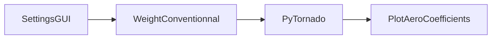
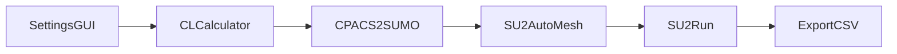

[](https://ceasiompy.readthedocs.io/en/latest/?badge=latest)
[](https://github.com/cfsengineering/CEASIOMpy/actions/workflows/pytest.yml)
[](https://codecov.io/gh/cfsengineering/CEASIOMpy)
[](https://github.com/cfsengineering/CEASIOMpy/blob/main/LICENSE)
[](https://github.com/psf/black)


# CEASIOMpy


CEASIOMpy is an open source conceptual aircraft design environment. CEASIOMpy can be used to set up complex design and optimization workflows, both for conventional and unconventional aircraft configurations. Tools for various disciplines in aircraft design are provided, however, the aerodynamic tools are the most developed. They allow to automatically generate aerodynamic meshes and perform CFD calculation.

CEASIOMpy is written mostly in Python but it also depends on third-party libraries and software (like [SU2](https://su2code.github.io/) for the CFD calculation).

CEASIOMpy is based on the open-standard format [CPACS](https://www.cpacs.de/), a *Common Parametric Aircraft Configuration Schema*. It is a data definition for the air transportation system which is developed by the German Aerospace Center [DLR](https://www.dlr.de/). CPACS enables engineers to exchange information between their tools.

:scroll: CEASIOMpy is maintained by [CFS Engineering](https://cfse.ch/) and [Airinnova](https://airinnova.se/). CEASIOMpy is under the [Apache License 2.0](https://github.com/cfsengineering/CEASIOMpy/blob/main/LICENSE).

:book: The Documentation of CEASIOMpy is integrated in this repository and can be read in document like this one. Follow links to find the information that you are looking for.

## Table of contents

 - [Installation](#installation)
 - [Usage](#usage)
   - [Run CEASIOMpy](#run-ceasiompy)
   - [Examples of workflows](#examples-of-workflows)
   - [Test cases](#test-cases)
   - [Available modules](#available-modules)
 - [Contributing](#contributing)
 - [References](#references)


## Installation

To install CEASIOMpy, please refer to the [installation page](./installation/INSTALLATION.md), it will guide you through the installation process depending on your system.


## Usage

### Run CEASIOMpy

- **Run CEASIOMpy with a GUI to build the workflow**
    
    If you run CEASIOMpy with the following command, you can build the workflow from the user interface.

    ```bash
    cd CEASIOMpy/ceasiompy
    python run_ceasiompy.py -gui
    ```

- **Run CEASIOMpy with an existing configuration file**

    You can run an existing configuration file (e.g. from the [test cases](#test-cases) with the following command.

    ```bash
    cd CEASIOMpy/ceasiompy
    python run_ceasiompy.py -cfg ../test_cases/config_test_case_1.cfg
    ```

- **Write a CEASIOMpy configuration file**

    A CEASIOMpy configuration file is a text file (saved as `*.cfg`) which contains the information necessary to run CEASIOMpy. You can write a configuration file by following the example.

    ```text
    % CEASIOMpy configuration file

    % Input CPACS files (required) which contain the aircraft geometry
    CPACS_TOOLINPUT = /users/disk10/jungo/github/CEASIOMpy/test_files/CPACSfiles/D150_simple.xml

    # Modules which will be used in the workflow (in order)
    MODULE_TO_RUN = ( SettingsGUI, PyTornado, PlotAeroCoefficients )
    ```

### Examples of workflows

- **Simple workflow with PyTornado (Vortex Lattice Method)**

<div align="center">


</div>


- **Simple workflow SU2 (CFD)**

<div align="center">


</div>


### Test cases

We have a few [test cases](./test_cases/TESTCASES.md) that can be used to test the functionality of CEASIOMpy and understand how it works.


### Available modules

A lot of different modules are available in CEASIOMpy, they can be assembled in various workflows. You can find bellow the list of available modules. The module status is marked as follows:

:white_check_mark: : The module should be working as expected. Some small bugs may be present, don't hesitate to report them.

:warning: : The module is not working fully as expected. It is not a bug, but some features or data handling are yet compatible with the new file structure. Check the [Kanban board](https://github.com/cfsengineering/CEASIOMpy/projects/1) to see planned and in progress features.

:x: : The module is not working at all. Some function have been written but requires a lot of changes to be compatible with the rest of CEASIOMpy.


#### General modules

- SettingsGUI :white_check_mark:
-  [ModuleTemplate](./ceasiompy/ModuleTemplate/README.md) :white_check_mark:
- Optimisation :x:
- SMTrain :x:
- SMUse :x:


#### Geometry and Mesh

- CPACSCreator :white_check_mark:
- CPACS2SUMO :white_check_mark:
- SUMOAutoMesh :white_check_mark:
- SU2MeshDef :warning:


#### Aerodynamics

- CLCalculator :white_check_mark:
- PyTornado :white_check_mark:
- SU2Run :white_check_mark:
- SkinFriction :white_check_mark:
- PlotAeroCoefficients :white_check_mark:


#### Weight and Balance

- BalanceConventional :warning:
- BalanceUnconventional :warning:
- WeightConventional :warning:
- WeightUnconventional :warning:


#### Mission Analysis

- Range :warning:
- StabilityStatic :warning:
- StabilityDynamic :x:


#### Structure 

- AeroFrame :x:


## Contributing

CEASIOMpy is an open source project and we welcome contributions from everyone. Some CEASIOMpy modules have been developed by students during their internship or master thesis.
If you want to contribute to the development of CEASIOMpy , please refer to the [CONTRIBUTING.md](./CONTRIBUTING.md) document.


## References

<!-- How to cite a reference [[1]](#Dett19) -->
 
<a id="Dett19">[1]</a> Dettmann, A.: Loosely coupled, modular framework for linear static aeroelastic analyses. Master Thesis (2019). KTH Royal Institute of Technology. http://kth.diva-portal.org/smash/record.jsf?pid=diva2:1360722

<a id="Picc19">[2]</a> Piccini, S.: A Weight and Balance evaluation software for conventional and unconventional aircraft design. Master Thesis (2019). LINK

<a id="Sigg19">[3]</a> Siggel, M. and Kleinert, J. and Stollenwerk, T. and Maierl, R.: TiGL: An Open Source Computational Geometry Library for Parametric Aircraft Design. Mathematics in Computer Science (2019). [10.1007/s11786-019-00401-y](https://link.springer.com/article/10.1007/s11786-019-00401-y)  

<a id="Drou18">[4]</a> Drougard, M.: Computer-Aided Design for Aircraft. Master Thesis (2018). EPFL École polytechnique fédérale de Lausanne. LINK  
