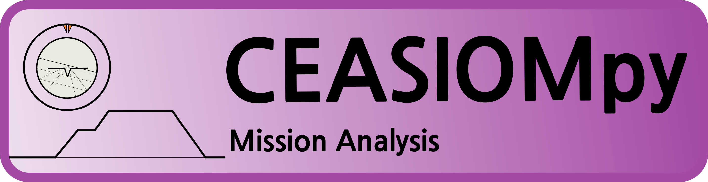
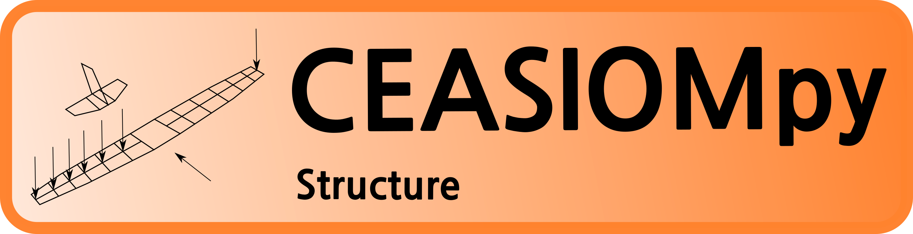
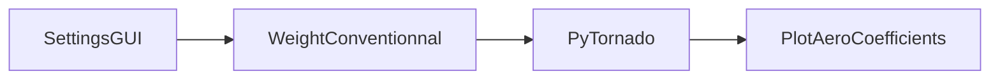
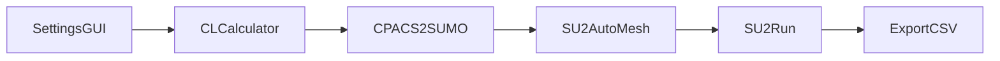

[](https://ceasiompy.readthedocs.io/en/latest/?badge=latest)
[](https://github.com/cfsengineering/CEASIOMpy/actions/workflows/pytest.yml)
[](https://codecov.io/gh/cfsengineering/CEASIOMpy)
[](https://github.com/cfsengineering/CEASIOMpy/blob/main/LICENSE)
[](https://github.com/psf/black)


# CEASIOMpy


CEASIOMpy is an open source conceptual aircraft design environment. CEASIOMpy can be used to set up complex design and optimization workflows, both for conventional and unconventional aircraft configurations. Tools for various disciplines in aircraft design are provided, however, the aerodynamic tools are the most developed. They allow to automatically generate aerodynamic meshes and perform CFD calculation.

CEASIOMpy is written mostly in Python but it also depends on third-party libraries and software (like [SU2](https://su2code.github.io/) for the CFD calculation).

CEASIOMpy is based on the open-standard format [CPACS](www.cpacs.de), a *Common Parametric Aircraft Configuration Schema*. It is a data definition for the air transportation system which is developed by the German Aerospace Center [DLR](https://www.dlr.de/). CPACS enables engineers to exchange information between their tools.

CEASIOMpy is maintained by [CFS Engineering](https://cfse.ch/) and [Airinnova](https://airinnova.se/). CEASIOMpy is under the [Apache License 2.0](https://github.com/cfsengineering/CEASIOMpy/blob/main/LICENSE).

------------

## Installation

To install CEASIOMpy, please refer to the [installation documentation](./installation/INSTALLATION.md).


## Usage

### Available modules

A lot of different modules are available in CEASIOMpy, they can be assembled in various workflows. The following modules are available:

#### General modules

- SettingsGUI
- ModuleTemplate
<!-- - Optimisation
- SMTrain
- SMUse -->


#### Geometry and Mesh

- CPACSCreator
- CPACS2SUMO
- SUMOAutoMesh
<!-- - SU2MeshDef -->


#### Aerodynamics

- CLCalculator
- PyTornado
- SU2Run
- SkinFriction
- PlotAeroCoefficients


#### Weight and Balance

- BalanceConventional
- BalanceUnconventional
- WeightConventional
- WeightUnconventional




#### Mission Analysis

- Range
- StabilityStatic
<!-- - StabilityDynamic -->


<!-- 


### Examples of workflows

#### Simple workflow with PyTornado (Vortex Lattice Method)

<div align="center">


</div>


#### Simple workflow SU2 (CFD)

<div align="center">


</div>


### Run CEASIOMpy

#### Run CEASIOMpy with a GUI to build the workflow

```bash
cd CEASIOMpy/ceasiompy
python run_ceasiompy.py -gui
```

#### Run CEASIOMpy with an existing workflow

```bash
cd CEASIOMpy/ceasiompy
python run_ceasiompy.py -cfg <path to config file>
```

------------

## Contributing

CEASIOMpy is an open source project and we welcome contributions from everyone. Some CEASIOMpy modules have been developed by students during their internship or master thesis.
If you want to contribute to the development of CEASIOMpy , please refer to the [CONTRIBUTING.md](./CONTRIBUTING.md) document.


