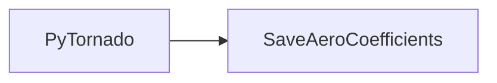
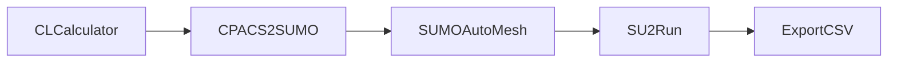

[](https://github.com/cfsengineering/CEASIOMpy/actions/workflows/unittests.yml)
[](https://github.com/cfsengineering/CEASIOMpy/actions/workflows/integrationtests.yml)
[](https://codecov.io/gh/cfsengineering/CEASIOMpy)
[](https://www.codacy.com/gh/cfsengineering/CEASIOMpy/dashboard?utm_source=github.com&amp;utm_medium=referral&amp;utm_content=cfsengineering/CEASIOMpy&amp;utm_campaign=Badge_Grade)
[](https://github.com/psf/black)
[](https://github.com/cfsengineering/CEASIOMpy/blob/main/LICENSE)

# CEASIOMpy


CEASIOMpy is an open source conceptual aircraft design environment. CEASIOMpy can be used to set up complex design and optimisation workflows for both conventional and unconventional aircraft configurations. Tools for various aircraft design disciplines are provided, but the aerodynamic tools are the most advanced. They allow automatic generation of aerodynamic meshes and CFD calculations.

CEASIOMpy is mostly written in Python but it also depends on third-party libraries and software (like [SU2](https://su2code.github.io/) for the CFD calculation).

CEASIOMpy is based on the open-standard format [CPACS](https://www.cpacs.de/), a *Common Parametric Aircraft Configuration Schema*. It is a data definition for the air transportation system which is developed by the German Aerospace Center [DLR](https://www.dlr.de/). CPACS enables engineers to exchange information between their tools.

:scroll: CEASIOMpy is maintained by [CFS Engineering](https://cfse.ch/) and [Airinnova](https://airinnova.se/). CEASIOMpy is under the [Apache License 2.0](https://github.com/cfsengineering/CEASIOMpy/blob/main/LICENSE).

:book: The Documentation of CEASIOMpy is integrated in this repository and can be read in documents like this one. Follow links to find the information that you are looking for.

## Table of contents

- [Installation](#installation)
- [Usage](#usage)
  - [Test cases](#test-cases)
  - [Run CEASIOMpy](#run-ceasiompy)
  - [Examples of workflows](#examples-of-workflows)
  - [Available modules](#available-modules)
- [Contributing](#contributing)
- [More Information](#more-information)

## Installation

To install CEASIOMpy, please refer to the [installation page](installation/INSTALLATION.md), it will guide you through the installation process depending on your system.

## Usage

### Demo

[](https://www.youtube.com/watch?v=d-AaSrF5g3k)

### Test cases

These test cases are there to learn how to use CEASIOMpy. You will probably also learn a few things about the CPACS format. You can also run these tests to verify that everything is installed and working as expected as they cover different possible ways of using CEASIOMpy. Be sure you finish the [installation](installation/INSTALLATION.md) before you try them.

- [Test case 1](test_cases/test_case_1/README.md) : Run a simple workflow
- [Test case 2](test_cases/test_case_2/README.md) : Create and run a workflow with the Graphical User Interface (Video tutorial)
- [Test case 3](test_cases/test_case_3/README.md) : Create and run a workflow with the Graphical User Interface
- [Test case 4](test_cases/test_case_4/README.md) : Create and run a from a command line
- [Test case 5](test_cases/test_case_5/README.md) : Create and run a from a configuration file

### Run CEASIOMpy

- **Run CEASIOMpy with a GUI to build the workflow**

    If you run CEASIOMpy with the following command, you can build the workflow with a graphical user interface.

    ```bash
    ceasiompy_run --gui
    ```

- **Run CEASIOMpy with a command line to build the workflow**

    If you run CEASIOMpy with the following command, you can build the workflow directly by defining the CPACS files and the modules you want to use.

    ```bash
    cd WKDIR
    ceasiompy_run -m ../test_files/CPACSfiles/D150_simple.xml PyTornado SaveAeroCoefficients
    ```

Follow the [test cases](#test-cases) to discover the different way of using CEASIOMpy.

### Examples of workflows

- **Simple workflow with PyTornado (Vortex Lattice Method)**

<div align="center">



</div>

- **Workflow with SU2 (CFD) at fixed CL**

<div align="center">



</div>

### Available modules

There are many different modules available in CEASIOMpy that can be combined in different workflows. The list of available modules is shown below. The module status is marked as follows:

:heavy_check_mark: : The module should work as expected. There may be some minor bugs, don't hesitate to report them (more details [here](CONTRIBUTING.md#reporting-bugs)).

warning: : The module does not work completely as expected. It is not a bug, but some features or data handling are not yet compatible with the new file structure. Check the [Kanban Board](https://github.com/cfsengineering/CEASIOMpy/projects/1) to see planned and in-progress features.

:x: : The module does not work at all. Some functions have been written, but need a lot of changes to be compatible with the rest of CEASIOMpy.


#### General modules

- [ModuleTemplate](ceasiompy/ModuleTemplate/README.md) :heavy_check_mark:
- [Optimisation](ceasiompy/Optimisation/README.md) :x:
- [SMTrain](ceasiompy/SMTrain/README.md) :x:
- [SMUse](ceasiompy/SMUse/README.md) :x:
- [ThermoData](ceasiompy/ThermoData/README.md) :heavy_check_mark:


#### Geometry and Mesh

- [CPACSCreator](ceasiompy/CPACSCreator/README.md) :heavy_check_mark:
- [CPACS2GMSH](ceasiompy/CPACS2GMSH/README.md) :heavy_check_mark:
- [CPACS2SUMO](ceasiompy/CPACS2SUMO/README.md) :heavy_check_mark:
- [SUMOAutoMesh](ceasiompy/SUMOAutoMesh/README.md) :heavy_check_mark:
- SU2MeshDef :warning:


#### Aerodynamics

- [CLCalculator](ceasiompy/CLCalculator/README.md) :heavy_check_mark:
- [PyTornado](ceasiompy/PyTornado/README.md) :heavy_check_mark:
- [PyAVL](ceasiompy/PyAVL/README.md) :heavy_check_mark:
- [SU2Run](ceasiompy/SU2Run/README.md) :heavy_check_mark:
- [SkinFriction](ceasiompy/SkinFriction/README.md) :heavy_check_mark:
- [SaveAeroCoefficients](ceasiompy/SaveAeroCoefficients/README.md) :heavy_check_mark:


#### Weight and Balance

- BalanceConventional :warning:
- BalanceUnconventional :warning:
- [WeightConventional](./ceasiompy/WeightConventional/README.md) :heavy_check_mark:
- WeightUnconventional :warning:


#### Mission Analysis

- Range :warning:
- [StaticStability](./ceasiompy/StaticStability/README.md) :heavy_check_mark:


#### Structure

- AeroFrame :x:

## Contributing

CEASIOMpy is an open source project and we welcome contributions from everyone. Some CEASIOMpy modules have been developed by students as part of their internship or master thesis.

If you want to contribute to the development of CEASIOMpy, please read the document [CONTRIBUTING.md](CONTRIBUTING.md).

## More information

- [CEASIOMpy YouTube channel](https://www.youtube.com/channel/UCcGsFJV29os1Zzv66YKFRZQ)
- [CFS Engineering](https://cfse.ch/)
- [Airinnova](https://airinnova.se/)
