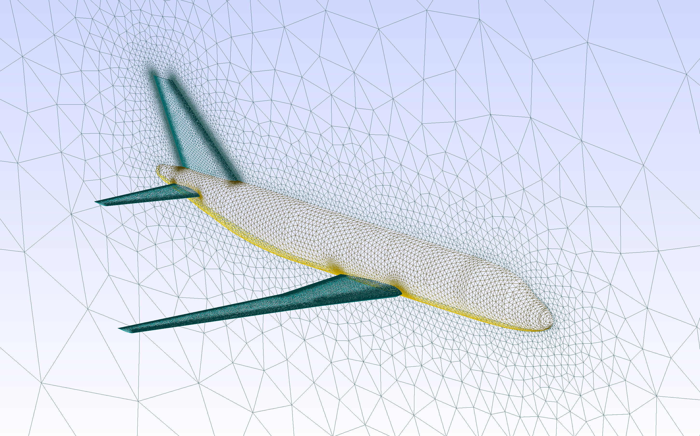

# CPACS2GMSH

**Categories:** Geometry, Mesh

**State**: :heavy_check_mark:

 

`CPACS2GMSH` is an automatic mesh generator module for a [CPACS](https://www.cpacs.de) aircraft geometry [[1]](#Alder20) using [GMSH](https://gmsh.info/) ,a finite element mesh generator.

It's currently possible to choose between two options for 3D meshing of the external domain.
Selecting the 'Euler' an unstructured mesh is automatically generated in a spherical domain surrounding the aircraft.
Instead, selecting the 'RANS' option Gmsh will generate only the 2D mesh of the entire aircraft, which will then be processed by the programme Pentagrow to generate the structured part that wraps the geometry, then [Tetgen](https://wias-berlin.de/software/tetgen/1.5/doc/manual/manual.pdf) package provides for meshing of the unstructured part. The hybrid mesh obtained will constitute the 3D domain.

The resulting mesh can be used for a CFD calculation by connecting the `SU2Run` module after `CPACS2GMSH` module.

 

Surface mesh of the D150 aircraft, with a symmetry plane

By Euler if an engine (simple or doubleflux) is part of the aircraft geometry, CPACS2GMSH will combine the different nacelle parts in one engine and  will add an intake and exhaust surface that can be used by SU2Run to simulate the engine operation. For doubleflux engines, only one intake surface will be placed on the fan cowl and two exhaust surfaces will be placed on the fan and center cowl.

If the aircraft geometry contains propeller engines, their blades will be replaced by 2D disk surfaces in order to simulate the propeller engines with SU2 disk actuator model.

Surface mesh of an aircraft with propeller engines

## Inputs

`CPACS2GMSH` takes as input a CPACS file. This is done automatically when it is run in workflow.

Multiple options are available with `CPACS2GMSH`, you can see these options if you run this module from the GUI interface.

General options:

* `Open GMSH GUI : False`
Open the gmsh GUI after the generation of the surface mesh (2D) and the domain mesh (3D) to see the mesh. This option is usefully to control the quality of the automated generated mesh or make extra operation with gmsh GUI.
* `Export propellers : False`
Export a 2D disk surfaces in order to simulate the propeller engines with SU2 disk actuator model.

Mesh type:
* `Choice the mesh type: Euler or RANS`
Choose between an unstructured domain (Euler) and an hybrid domain (RANS)

Domain:

* `Use Symmetry : False`
Apply a symmetry operation to the model with a xz symmetry plane in the center of the aircraft. The resulting mesh will only be generated in the y positive domain (only for Euler for now).

* `Farfield size factor : 10.0`
Enable to control the spherical domain size. The fluid domain surrounding the aircraft is defined with a radius equivalent to the largest xyz aircraft dimension times the `Farfield size factor

Mesh options:

* `Farfield : depends on the aircraft` Factor for the mesh size of the farfield surfaces compared to the biggest cell on the surface mesh.
* `Fuselage : depends on the aircraft` Factor for the mesh size of the farfield surfaces (bigger factor = finer mesh)
* `Wings : depends on the aircraft` Factor for the mesh size of the farfield surfaces (bigger factor = finer mesh)
* `Engines : 0.23` Mesh size of the engines surfaces
* `Propellers : 0.23` Mesh size of the propellers surfaces

:warning: The mesh size values are unitless. They are consistent with the aircraft dimensions units.

RANS options:

* `Number of layer: 20`
Number of prismatic element layers
* `Height of first layer: 3 e-5 mm`
Height of the first prismatic cell, touching the wall, in mesh length units.
* `Max layer thickness: 100 mm`
The maximum allowed absolute thickness of the prismatic layer.
* `Growth ratio: 1.2`
Max growth ratio accepted between wall-normal edge lengths of consecutive cells in the boundary layer
* `Growth factor: 1.4`
Growth factor between edge lengths of coincident tetrahedra
* `Feature angle: 40 grad`
Whenever the dihedral angle of two triangle is smaller than this limit, the resulting edge is understood to represent an actual geometrical feature. Larger angles are treated as resulting from approximation of curved surfaces by linear triangles

Advanced mesh parameters :

* `LE/TE refinement factor : 7.0`
Apply a refinement on the leading and trailing edge of the aircraft wings. the element size at the le/te will be set to the wing mesh size divided by the refinement factor. This refinement decay according to a power law from the edge to 30% of the wing section cord length, where the mesh size is the wing's one.
* `n power factor : 2`
Power of the power law of the refinement on LE and TE. 
* `n power field : 0.9`
Value that changes the measure of fist cells near aircraft parts. Only used for Euler mesh
* `Refine truncated TE : False`
For truncated wing profile, automatically adjust the LE/TE refinement factor such that the mesh size at the TE match the truncated TE thickness .
* `Auto refine : False`
Apply an automatic refinement of surfaces which are small compare to a mesh element. :warning: With this option activated, the surface mesh generation maybe done two times, which increasing the total meshing time.
* ` Refinement factor of lines in between angled surfaces : 1.5`
Refining lines that are between two surfaces that are "far from flat", as for example the right angle between a wing and the fuselage. Only for RANS, and sometime misses some lines.

Engines :

* `Engine intake position [%] : 20.0`
Engine intake surface position from the front of the engine fan cowl in percent of the fan cowl length
* `Engine exhaust position [%] : 20.0`
Engine exhaust surface position from the back of the engine fan cowl in percent of the fan cowl length, if the engine is doubleflux, and exhaust surface is similarly generated for the center cowl part of the engine.

:warning: It is recommended to check the mesh convergence to know which value gives the best trade-off between the results accuracy and computation time, for your application case.

## Analyses

`CPACS2GMSH` Generate .brep files with TiGL for each part of the aircraft configuration. Then all the parts are imported into GMSH to generates a SU2 mesh file
for the euler case, instead a .stl file is generated to be read by pentagrow

## Outputs

`CPACS2GMSH` outputs a SU2 mesh files (.su2), the path to this file is saved in the CPACS file under this xpath: /cpacs/toolspecific/CEASIOMpy/filesPath/su2Mesh.

With RANS also a configuration file is created in the same directory containing the setup used to generate the hybrid mesh.

## Installation or requirements

`CPACS2GMSH` is a native CEASIOMpy module, hence it is available and installed by default. To run it, you just have to be sure that you are in the CEASIOMpy Conda environment.

## Limitations

At the time of writing, this module is not able to handle aircraft with control surfaces (they will not be modelled and thus appear in the final mesh).

For the RANS part, it is only possible to process aircraft consisting of .brep files of category 'fuselage' and 'wing'

## More information

* [CPACS official website](https://www.cpacs.de)

* [GMSH official website](https://gmsh.info/)
