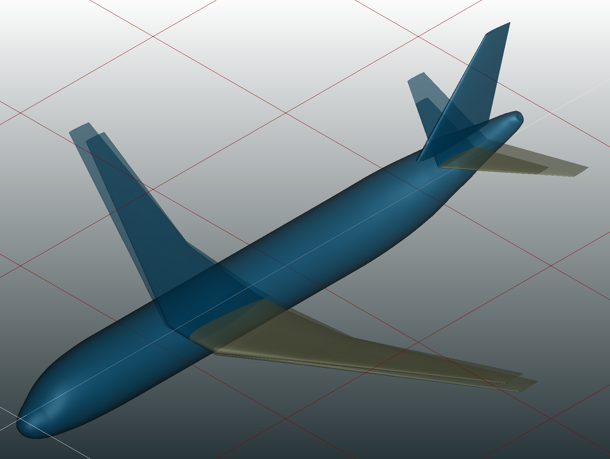

# Optimisation

**Categories:** Optimisation, DoE

**State**: :x: must be refactored to work version of the code (see [Issue #147](https://github.com/cfsengineering/CEASIOMpy/issues/169))

`Optimisation` module launches a loop with a workflow routine and an optimiser based on the [Openmdao](https://openmdao.org/) library. It could also be used to run Design of Experiments (DOE).

Two geometies superposed, before and after optimisation.

## Inputs

`Optimisation` takes as input a CPACS file, it must contained the following inputs:

- Optimiser parameters : Including the design variables, the target parameter and the constrains.

- Path to a CSV file containing the specifications of each parameter of the problem.

## Analyses

`Optimisation` module enhances the design of the plane to find an optimum for a user-specified parameter, given a list of design variables, objectives and constrains.

## Outputs

`Optimisation` module outputs a html file for a visualization of the problem, two recording files used to plot the results (‘circuit.sqlite’, ‘Driver_recorder.qsl’) and a CSV file containing the variables history.

## Installation or requirements

`Optimisation` is a native CEASIOMpy module, hence it is available and installed by default. It is base on the [Openmdao](https://openmdao.org/) framework.

## Limitations

The geometric modification of the fuselage may cause some issue due to some problem with the TiGL library.

## More information

* [Openmdao](https://openmdao.org/)
