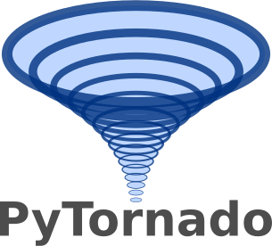

# PyTornado

**Categories:** Aerodynamics, CFD, aeromaps

**State**: :heavy_check_mark:



`PyTornado` module is a launcher for the software [PyTornado](https://github.com/airinnova/pytornado) which has been developed by [Airinnova](https://airinnova.se/) based on the Matlab version of [Tornado](https://tornado.redhammer.se/index.php). It is a Vortex Lattice Method (VLM) solver for  low-fidelity aerodynamic analysis of wings.

## Inputs

`PyTornado` takes as input a CPACS file, the aircraft geometry will be use to create the mesh required by the VLM solver. To define the flight conditions an aeromap on which the calculation will be done is also required.

## Analyses

`PyTornado` calculates aerodynamic coefficients of an aircraft for a given aeromap and write back results in a CPACS file.

Optionally, `PyTornado` can also plot some results.

<p align="center">

</p>
<p align="center">
Example of PyTornado results.
</p>

## Outputs

`PyTornado` outputs a CPACS files with the calculated aerodynamic coefficients added into the aeromap.

## Installation or requirements

`PyTornado` can be installed by first cloning the [PyTornado repository](https://github.com/airinnova/pytornado.git) and then use pip to install it. The command should be the following:

```bash
git clone https://github.com/airinnova/pytornado.git
cd pytornado
pip install -e .
```

If you follow an automatic installation procedure on the [CEASIOMpy installation page](../../installation/INSTALLATION.md), PyTornado should be installed automatically with the other tools.

## Limitations

`PyTornado` is a Vortex Lattice Method (VLM) solver and the assumption are the following:

* The flow field is incompressible (Ma < 0.5), inviscid and irrotational.

* The lifting surfaces are thin. The influence of the thickness on aerodynamic forces are neglected.
* The angle of attack and the angle of sideslip are both small (small angle approximation)

:warning: No fuselage is modelled by `PyTornado` so the drag coefficient is not correct, generally underestimated.

## More information

* [PyTornado Github repository](ttps://github.com/airinnova/pytornado)

* [PyTornado Documentation](https://pytornado.readthedocs.io/en/latest/)

* [Original Matlab version of Tornado](https://tornado.redhammer.se/index.php)

* [Flight Vehicle Aerodynamics](https://mitpress.mit.edu/books/flight-vehicle-aerodynamics) by Mark Drela

* <https://en.wikipedia.org/wiki/Vortex_lattice_method>

## References

<a id="Melin2000">[1]</a> Melin, T.: A Vortex Lattice MATLAB Implementation for Linear Aerodynamic Wing Applications, Diss., December 2000. <http://dx.doi.org/10.13140/RG.2.2.24472.49923>

<a id="Drela14">[2]</a> Drela, M.: Flight Vehicle Aerodynamics. Cambridge, Massachusetts: MIT Press, 2014. – ISBN 978-0-262-52644-9

<a id="Dett19">[3]</a> Dettmann, A.: Loosely coupled, modular framework for linear static aeroelastic analyses. Master Thesis (2019). KTH Royal Institute of Technology. <http://kth.diva-portal.org/smash/record.jsf?pid=diva2:1360722>
