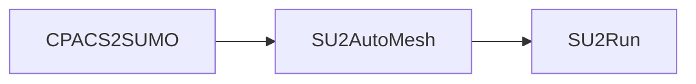

# SUMOAutoMesh

**Categories:** Mesh

**State**: :heavy_check_mark:

`SUMOAutoMesh` generates automatically a [SU2](https://su2code.github.io/) mesh file from a [SUMO](https://www.larosterna.com/products/open-source) (.smx) geometry file.

## Inputs

`SUMOAutoMesh` takes as input a CPACS file but the path to the SUMO file must be given in the CPACS file under this xpath: `/cpacs/toolspecific/CEASIOMpy/filesPath/sumoFilePath`. This is done automatically when it is run in workflow like this one:

To define the size of the mesh only one option can be set by the user, it is called `refinement level`. By default it is set to `1.0`. The scale is logarithmic, that is to say:

* `refinement level = 1.0` : the mesh generated will have the default number of cells.
* `refinement level = 2.0` : the mesh generated will have twice the number of cells.
* `refinement level = 3.0` : the mesh generated will have four times the number of cells.
* ...

:warning: It is recommended to check the mesh convergence to know which value gives the best trade-off between the results accuracy and computation time, for your application case.

## Analyses

`SUMOAutoMesh` runs SUMO with batch mode to generates a SU2 mesh file. Within this command, SUMO first generate a surface mesh made of triangles and then a volume mesh (with [Tetgen](https://wias-berlin.de/software/tetgen/features.html)) made of tetrahedra.

## Outputs

`SUMOAutoMesh` outputs a SU2 mesh files (.su2), the path to this file is saved in the CPACS file under this xpath: `/cpacs/toolspecific/CEASIOMpy/filesPath/su2Mesh`.

## Installation or requirements

`SUMOAutoMesh` is a native CEASIOMpy module, hence it is available and installed by default. To run it, you just have to be sure that you are in the CEASIOMpy Conda environment.

However to run `SUMOAutoMesh` module, SUMO, must be installed on your computer. Please refer to the [CEASIOMpy installation page](../../installation/INSTALLATION.md) for more information.

## Limitations

Sometimes `SUMOAutoMesh` may not succeed in generating a mesh. In this case, you can try to change the `refinement level` by `0.1` or `0.2`. Also, it may be difficult to mesh very small interstitial spaces between parts.

:warning: On MacOS, the mesh has to be generated manually, but SUMOAutoMesh will be useful to preset the mesh criterion. Also, SUMO gui will be launches when the mesh should be created. Then the user will have to:

* Open the .smx geometry will be given in the Terminal by SUMOAutoMesh when it is executed.
* Click on the button “Mesh”
* Click on “Create Mesh”
* Click on “Volume Mesh”
* Click on “Run”
* When the mesh generation is completed, click on “Close”
* Go to the Menu “Mesh” -> click on “Save volume mesh…”
* Chose “SU2 (*.su2)” as File Type”
* Copy/Paste the line (given by SUMOAutoMesh when it is executed) as File Name.
* Click on “Save”
* You can now close SUMO, your workflow will continue.

## More information

* [SUMO official website](https://www.larosterna.com/products/open-source)

* [Tetgen official website](https://wias-berlin.de/software/tetgen/features.html)

* [SU2 official website](https://su2code.github.io/)
