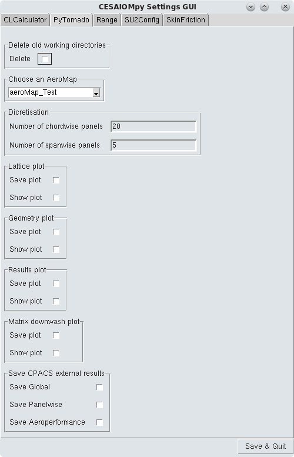

# SettingsGUI

**Categories:** General, Settings, GUI

**State**: :heavy_check_mark:

`SettingsGUI` is made to allow users to set up inputs for other modules of a workflow. If `SettingsGUI` is included in a workflow, it will propose to set value for all the following modules until the next `SettingsGUI` is found or the workflow is finished.

SettingsGUI interface

## Inputs

`SettingsGUI` takes as input a CPACS file and a list of modules that should be included for settings modification.

## Analyses

For each module in the list, `SettingsGUI` will automatically propose to set the inputs of the module. These inputs are base on the definition given by the `__specs__.py` file of the module. It allows create a tab to define, import, export and modify the aeromaps present in the CPACS file.

## Outputs

`SettingsGUI` outputs a CPACS files with the new values set by the user. It will be ready to be used by the next module in the workflow.

## Installation or requirements

`SettingsGUI` is a native CEASIOMpy module, hence it is available and installed by default. To run it, you just have to be sure that are you are in the CEASIOMpy Conda environment.

## Limitations

Values input that could be proposed to be changed in `SettingsGUI` must be fixed. For now, it cannot dynamically propose value to change that depends on other variables.

## More information

* [SettingsGUI main function](./settingsgui.py)
