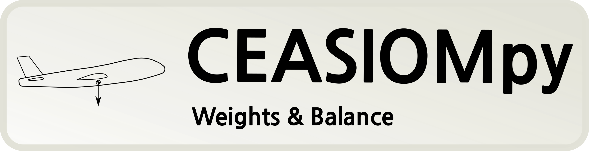

# WeightConventional

**Categories:** Weight, Estimation

**State**: :heavy_check_mark:

`WeightConventional` module can make estimation of a conventional aircraft masses:

- Maximum Take-Off Mass
- Operating Empty Mass
- Zero fuel mass

It also calculates other values which are required to calculate those masses, e.g.:

- Number of abreast
- Number of passenger
- Number of cabin crew member
- Wing loading

Example of workflow with the `WeightConventional` module:

## Inputs

`WeightConventional` takes as input a CPACS file, it use only the geometry of the aircraft to make estimations.

## Analyses

To estimate the MTOM, the `WeightConventional` module uses the following value (extracted form the CPACS geometry) based on a database of conventional aircraft.

- Wing area
- Wing Span
- Fuselage length
- Fuselage width

From MTOM it deduce other value from empirical relations.

From the fuselage geometry, it estimate the cabin size and a possible seat disposition to estimate the number of passenger.

## Outputs

`WeightConventional` outputs a CPACS file with the calculated masses. It also produce some text file in the result folder with more detail information.

## Installation or requirements

`WeightConventional` is a native CEASIOMpy module, hence it is available and installed by default. To run it, you just have to be sure that you are in the CEASIOMpy Conda environment.

## Limitations

:warning: `WeightConventional` make a lot of assumption and use some empirical relationship, results may differ a lot from the reality.

:warning: `WeightConventional` is based on interpolation base on existing aircraft, it will not be able to take into account if the aircraft you design uses new technologies or materials.

## More information

## References

<a id="Picc19">[1]</a> Piccini, S.: A Weight and Balance evaluation software for conventional and unconventional aircraft design. Master Thesis (2019). [pdf](files/Master_Thesis_report_Stefano_Piccini.pdf)
