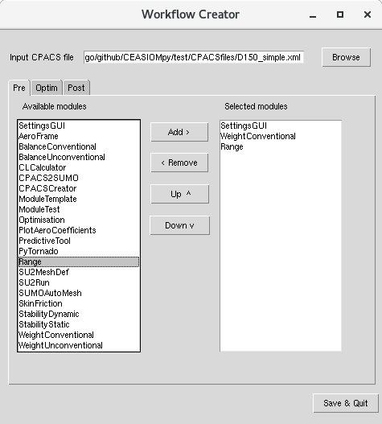
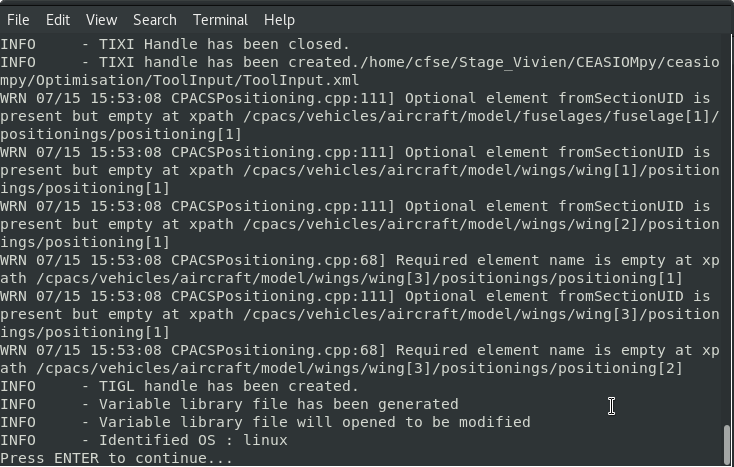

Getting started
===============

Once you finished the installation you could try to run the following test cases to familiarize yourself with |name|

Without RCE:
------------

If you want to use RCE to create your workflow, you can directly go to the next section.
If you cannot or do not want to install RCE on your computer, you can still use CEASIOMpy through the module 'WorkflowCreator'.

Test Case 1 : Simple workflow
*****************************

The module 'WorkflowCreator' can be found at /CEASIOMpy/ceasiompy/WorkflowCreator/workflowcreator.py you can run it by simply type in your terminal:

.. code::

    cd YourPath/CEASIOMpy/ceasiompy/WorkflowCreator/
    python workflowcreator.py -gui

.. hint::

    If you use a Linux you can easily set an alias in you .bashrc file to run these command with a shortcut of your choice.

When you run this module, a GUI will appear. The first thing to do is to chose the CPACS file we will use for this analysis, click on "Browse" and select "D150_simple.xml", it is a test aircraft similar to an A320 . Then, we will have the possibility to chose which module to run and in which order. For this first test case, we will use only the tab "Pre". On the left you will see the list of all available modules, when you select one you can add it to the list of module to execute. You can also remove module from this list or change the order with the buttons.
We will create a simple workflow with only three modules:

SettingsGUI -> WeightConventional -> Range.

Once you added these three modules in order you can click "Save & Quit". The first module to run will be "SettingsGUI", it will show you all the available options for the next modules. All the options are pre-filled with default values. You don't need to change any value for this example, so you can just click "Save & Quit".
The two next modules will be executed automatically without showing anything except some results in the terminal.

Test Case 2 : Aerodynamic database with PyTornado
*************************************************

In this example we will see how to create an aerodynamic database with PyTornado and plot them on a graph.
As in test case 1, we will run 'WorkflowCreator'. In the GUI, after selecting the same D150_simple.xml CPACS file, we will select some modules in the list and place them in order to create the following workflow:

CPACSCreator -> SettingsGUI -> PyTornado -> PlotAeroCoefficients

Then, you can click "Save & Quit". The first module to be executed will be CPACSCreator, with this module you can modify the geometry of the aircraft. We won't made changes now, but if you want to learn how to use CPACSCreator, you can follow the link bellow:

https://dlr-sc.github.io/tigl/doc/cpacscreator-0.1/tuto.html#tuto_create_from_scratch

If you apply some changes, save your modifications and close the CPACSCreator windows. Now, the SettingsGUI windows will appear, and first, we will import a new AeroMap.  Now, click on 'Import CSV' to add a new AeroMap, select 'Aeromap_4points_aoa.csv' and 'OK'.

.. figure:: getting_started_fig/TestCase2_ImportAeroMap.png
    :width: 400 px
    :align: center
    :alt: CEASIOMpy - Import AeroMap - Test case 2

You can also click on the 'aeromap_empty' and delete it with the buttons. You must click on the button 'Update' to make the new AeroMap available for all modules.

Now, you can click on the 'PyTornado' Tab, the AeroMap selected should be the one you imported before. We will not change the other option and just click 'Save & Quit'.

The software should run for a few seconds and when the calculation are done, a plot of the aerodynamic coefficient should appear.

Test Case 3 : SU2 at fixed CL and Range
***************************************

For this test case you can try to run the following workflow with the same aircraft. It will calculate the after performing a CFD analysis at fixed CL.

SettingsGUI -> WeightConventional -> CLCalculator -> CPACS2SUMO -> SUMOAutoMesh -> SU2Run -> SkinFriction -> Range

Test Case 4 : Optimising the CL
*******************************

To launch an optimisation routine or a DoE, launch the WorkflowCreator tool with the GUI and select the modules you want to run in the routine in the 'Optim' tab and select the Optim option from the type list. Here the modules 'WeightConventional' and 'PyTornado' are chosen.

    
The next window that opens is the SettingsGUI, were you can tune the options specific to each module. Focusing on the options of the Optimisation tab, different options can be set. In our case the 'Objective' is set on 'cl' and the 'Optimisationn goal' is set to 'max' in order to search for the maximal cl. The other options from the 'Optimisation settings' group are left at their default values and the 'DoE settings' group is not used in the case of an optimisation. 
The 'CSV file path' is left blank as we have not defined a file with the problem parameters.

After saving the settings a CSV file is automatically generated and opened with your standard CSV opener.

    
Here you can see all the parameters that can be used in the routine. The ones that appear in the objective function are labelled as 'obj' in the 'type' column, and the ones that are only outputs of some modules are labelled 'const', their type must not be changed. All the other parameters can have their values modified in the following columns :

.. code::
    ['type','min','max']

Or you can add a new element to the file if you know what to add. Here we suppress all the elements that we do not desire to have in our routine and we end up with just the parameters that we want for this optimisation. Note that you can also let some cases blank in the 'min' and 'max' columns if you don't want to restrain the domain on one side. The 'min' and 'max' values of the 'obj'-labelled parameters are not taken into account.

Save the file and close it, you must then press the enter key into the terminal to launch the routine. After that the routine is running and you just have to wait for the results.

When the routine finishes two windows are generated containing the history plots of the parameters on one and the objective function on the other. After closing these windows the program closes and you finished the process !

For the post-processing you can go in the WKDIR folder, where you will find the CEASIOMpy_Run with the corresponding date at which you launched the routine. In this file you will find the results of an initial run the program did befpore launching the optimisation loop and the 'Optim' folder, in which all the results of the routine are saved.

* Driver_recorder.sql : Recorder of the routine from the OpenMDAO library. It is used to access the history of the objective function.
* circuit.sqlite : File that is used to generate the N2 diagram of the problem.
* circuit.html : This file represents an N2 diagram of the problem that was solved, showing the dependencies of the variables between the different modules.
* Variable_library.csv : This file is the CSV that you modified before launching the routine.
* Variable_history.csv : This file contains the value of all the desired parameters at each iteration, plus the basic informations of the parameters (name, type, getcmd, setcmd).
* 
* Geometry : This folder contains the CPACS that is used in the routine at each iteration, this can be changed by tuning the 'Save geometry every' parameter in the Optimisation settings.
* Runs: This folder contains the directories of all the workflow runs that were made during the routine. These folders are equivalent to a simple CEASIOMpy_Run workflow folder.

Test Case 5 : Surrogate model for SU2
*************************************

With RCE:
---------

To run the following workflow you need to have a running version of RCE with the CEASIOMpy module installed. For more information check out the Step 3 of the installation page.

Test Case 1 : Simple workflow
*****************************

We will create a simple workflow which contains a CPACS input and three modules.

CPACS input -> SettingsGUI -> WeightConventional -> Range

Your workflow should look like that:

.. figure:: CEASIOMpy_RCE_TC1.png
    :width: 630 px
    :align: center
    :alt: CEASIOMpy - RCE - Test case 1

Test Case 2 : Aerodynamic database with PyTornado
*************************************************

CPACS input -> CPACSCreator -> PyTornado -> SkinFriction -> PlotAeroCoefficients

Test Case 3 : SU2 at fixed CL and Range
***************************************

CPACS input -> SettingsGUI -> WeightConventional -> CLCalculator -> CPACS2SUMO -> SUMOAutoMesh -> SU2Run -> SkinFriction -> Range

Module compatibility
--------------------

Visualization of which module can be connected to which other modules:

in development...
