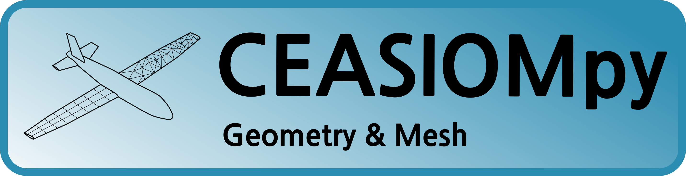
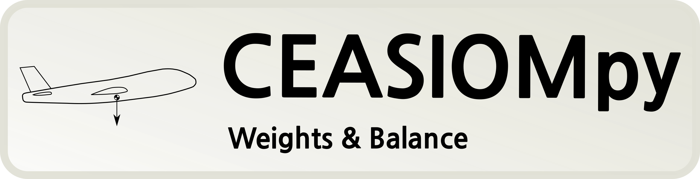

Modules
=======

|name| provides modules for different disciplines in aircraft design. Below you can find a list of available modules sorted by categories.

.. toctree::
   :maxdepth: 1

   modules/CPACSCreator/index
   modules/CPACS2SUMO/index
   modules/SUMOAutoMesh/index
   modules/SU2MeshDef/index

.. toctree::
   :maxdepth: 1

   modules/BalanceConventional/index
   modules/BalanceUnconventional/index
   modules/WeightConventional/index
   modules/WeightUnconventional/index

.. figure:: CEASIOMpy_banner_aero.png
    :width: 630 px
    :align: left
    :alt: CEASIOMpy aerodynamic

.. toctree::
   :maxdepth: 1

   modules/CLCalculator/index
   modules/PyTornado/index
   modules/SU2Run/index
   modules/SkinFriction/index
   modules/PlotAeroCoefficients/index

.. figure:: CEASIOMpy_banner_structure.png
    :width: 630 px
    :align: left
    :alt: CEASIOMpy structure

.. toctree::
   :maxdepth: 1

   modules/AeroFrame/index
   modules/FramAT/index

.. figure:: CEASIOMpy_banner_mission.png
    :width: 630 px
    :align: left
    :alt: CEASIOMpy missions analyses

.. toctree::
   :maxdepth: 1

   modules/Range/index
   modules/StabilityStatic/index
   modules/StabilityDynamic/index

.. toctree::
   :maxdepth: 1
   :caption: Miscellaneous

   modules/SettingsGUI/index
   modules/Optimisation/index
   modules/SMTrain/index
   modules/SMUse/index
   modules/ModuleTemplate/index
