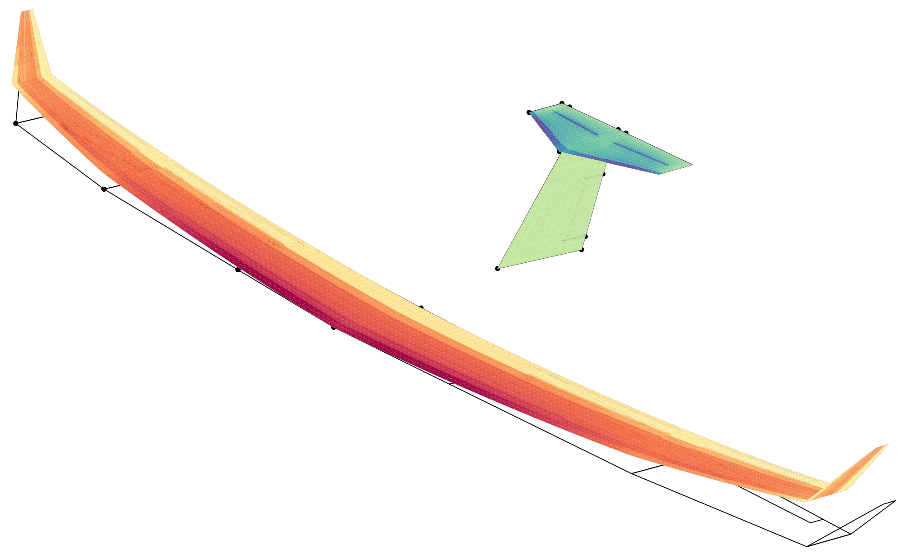

AeroFrame
=========

:Categories: Aeroelasticity, Aerodynamics, CFD, Structures

*AeroFrame* is a modular framework for partitioned aeroelastic analyses. The framework couples separate solvers for structure and CFD. It coordinates the analysis and the exchange of loads and deformations. Currently, AeroFrame supports static aeroelastic analyses.

    Wing deformations in a pull-up maneuver. Aerodynamics computed with the vortex-lattice method (VLM) and the structural repsonse with a beam FEM model (image from [Dett19]_).

Installation
------------

The AeroFrame library is installed *automatically* as an external dependency of |name|.

.. seealso::

    AeroFrame documentation: https://aeroframe.readthedocs.io/

Analyses
--------

TODO

Output
------

TODO

Required CPACS input and settings
---------------------------------

TODO

Limitations
-----------

TODO

More information
----------------

* **Documentation** https://aeroframe.readthedocs.io/
* **Github** https://github.com/airinnova/aeroframe
