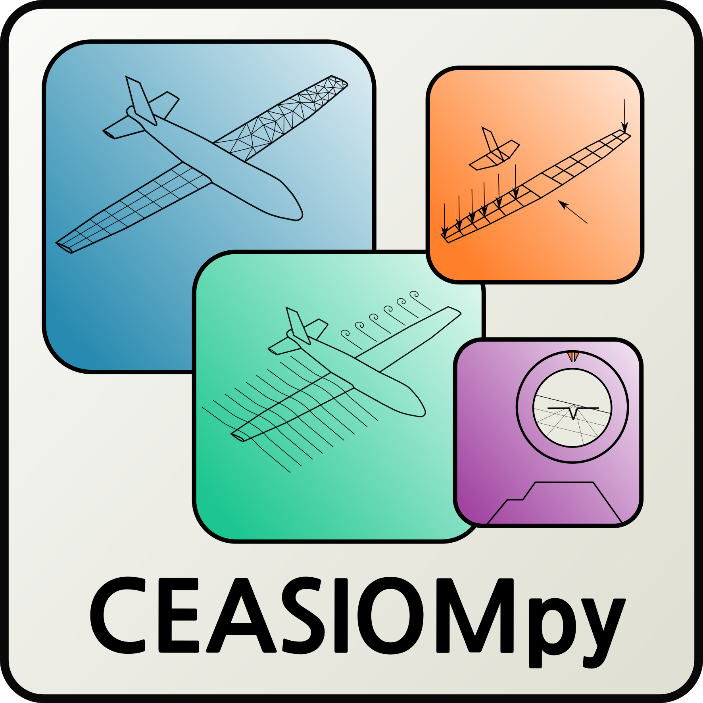

CPACSUpdater
============

:Categories: Aircraft geometry

This module can be used to modify the geometry of the aircraft with help of the TiGL handler.

Installation
------------

CPACSUpdater is a native |name| module, hence it is available and installed by default.

Analyses
--------

CPACSUpdater computes nothing.

Output
------

CPACSUpdater outputs nothing.

Required CPACS input and settings
---------------------------------

No CPACS input is required.

Limitations
-----------

CPACSUpdater does not permit modifications in the whole CPACS file as it is developped for geometric modifications only. 
Only functions of the TiGL library can be used.

More information
----------------

* More infos about the TiGL library https://dlr-sc.github.io/tigl/
