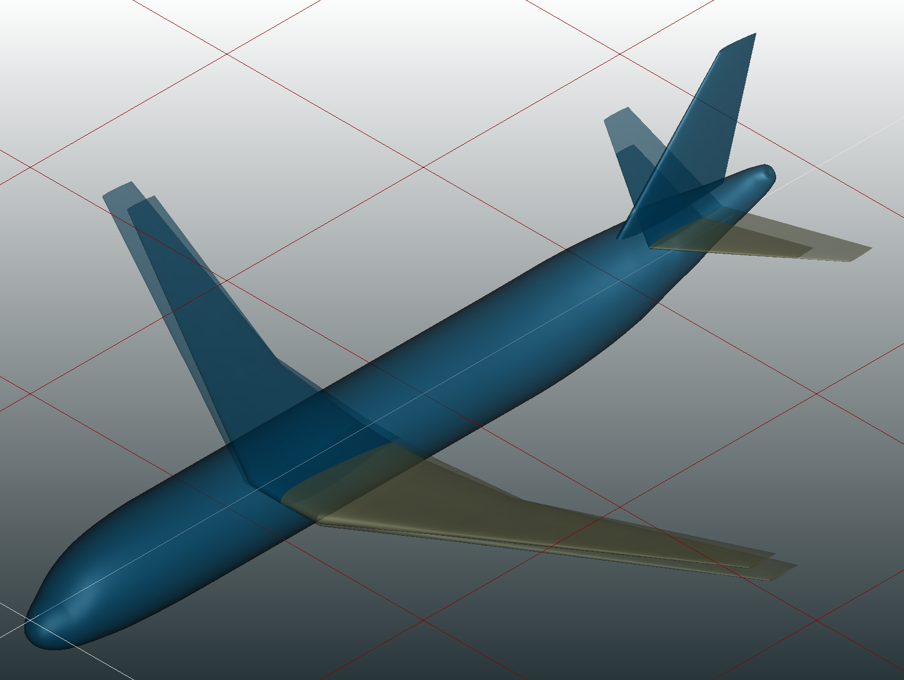

Optimisation
============

:Categories: Optimisation module

This module launches a loop with a workflow routine and an optimiser based on the Openmdao library.

    Wing modification at two different time steps of an optimisation routine.

Installation
------------

The optimisation module is a native |name| module, hence it is available and installed by default.

Analyses
--------

The optimisation module enhances the design of the plane to find an optimum for a user-specified parameter, given a list of design variables, objectives and constrains.

Output
------

Optimisation module outputs a html file for a vizualisation of the problem, two recording files used to plot the results ('circuit.sqlite', 'Driver_recorder.qsl') and a CSV file containing the variables history.

Required CPACS input and settings
---------------------------------

 * No CPACS inputs required as it only launches a workflow routine.
 * Optimiser parameters : Including the design variables, the target parameter and the constrains.
 * CSV file containing the specifications of each parameter of the problem.

Limitations
-----------

 * The geometric modification of the fuselage is not available for now.
 

More information
----------------

* https://openmdao.org/
