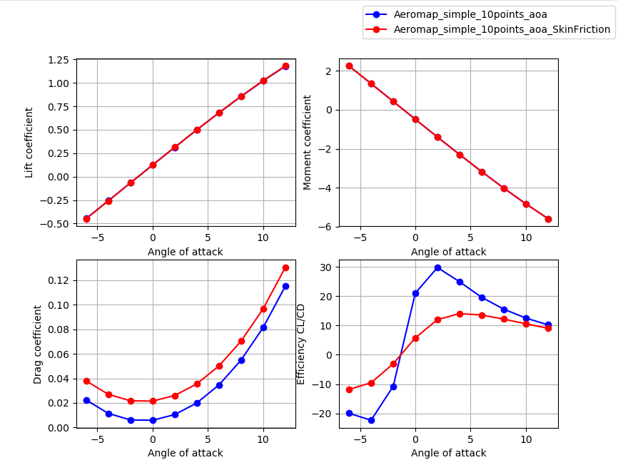

PlotAeroCoefficients
====================

:Categories: Aerodynamics, Results, Plot

This module allows to plot aerodynamic coefficients (Cl,Cd,Cm) for one or several aeroMaps.

    Typical results view with the PlotAeroCoefficients module

Installation
------------

PlotAeroCoefficients is a native |name| module, hence it is available and installed by default.

Analyses
--------

PlotAeroCoefficients computes nothing.

Output
------

PlotAeroCoefficients just plots the graph, it can be save with the Matplotlib interface.

Required CPACS input and settings
---------------------------------

The CPACS input file should contained at least one aeroMap with results.
