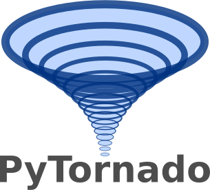
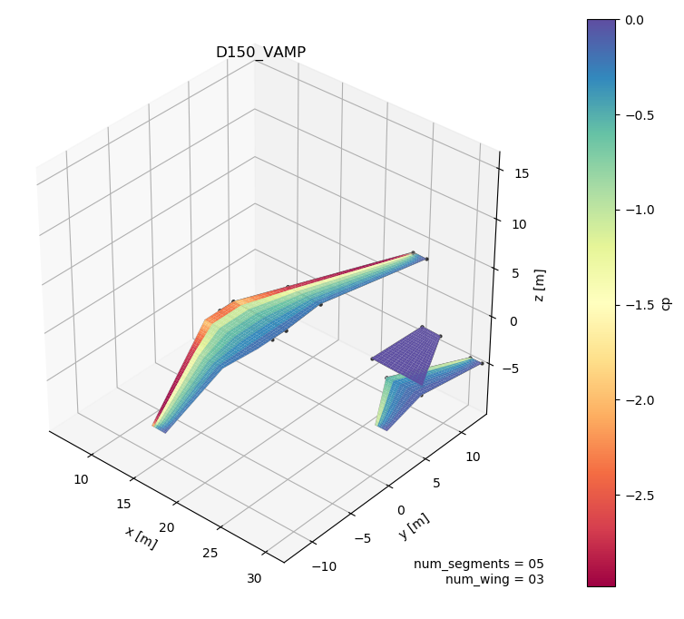

PyTornado
=========

:Categories: Aerodynamics, CFD, |Apms|

PyTornado is an aerodynamics module for fast, low-fidelity aerodynamics analyses. PyTornado is an implementation of the *vortex lattice method* (VLM), a potential flow CFD_ method.

    Example pressure plot

Installation
------------

Currently, PyTornado is an *external dependency*. If you want to use PyTornado, you will have to separately install the program on your system. Please refer to the installation guide for details:

* https://pytornado.readthedocs.io/en/latest/user_guide/installation.html

Analyses
--------

PyTornado evaluates |apms| and write back results. |apm_short_description|

Output
------

* |Apm| results are written back directly into the CPACS_ file.
* Additional result or plot files may be created from optional settings. All other output will be saved in a *wkdir* folder in the PyTornado module.

Required CPACS input and settings
---------------------------------

To run |name|, a CPACS_ |apm| is required.

.. hint::

    |Apms| can be created and edited using the *GUI settings editor* (**TODO** link). PyTornado specific settings can also be edited using the settings editor.

Limitations
-----------

The VLM is a based on *potential flow*, and classified as a low-fidelity CFD_ method. The aircraft itself is modelled as a collection of flat lifting surfaces. Please refer to the `PyTornado documentation <https://pytornado.readthedocs.io/>`_ for more details on the theory and limitations.

More information
----------------

* **Documentation** https://pytornado.readthedocs.io/
* **Github** https://github.com/airinnova/pytornado
