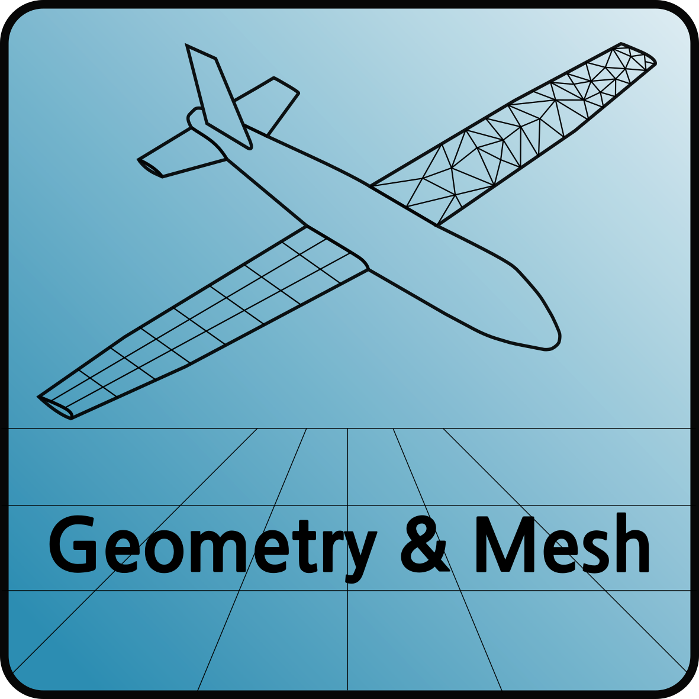
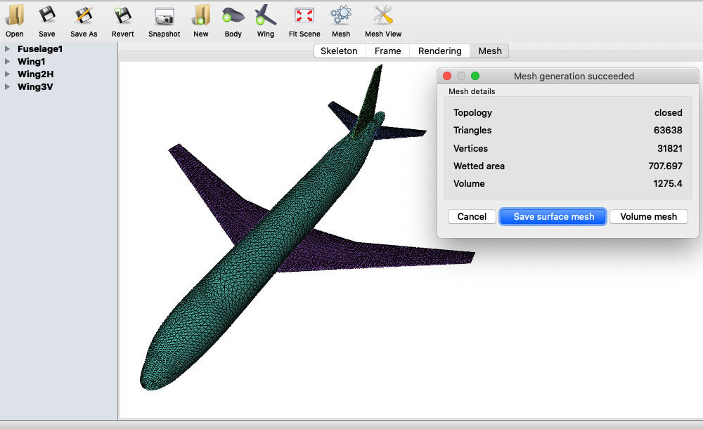

SUMOAutoMesh
============

:Categories: Geometry, meshing

SUMOAutoMesh generate automatically a SU2_ mesh from a SUMO_ SMX file.

Installation
------------

SUMOAutoMesh is a native |name| module, hence it is available and installed by default. The main module of SUMOAutoMesh can be found in /CEASIOMpy/ceasiompy/SUMOAutoMesh/sumoautomesh.py

Analyses
--------

SUMOAutoMesh create automatically a mesh that could be used by SU2. It generate first a surface mesh and then a volume mesh with Tetgen in a sphere around the aircraft. SUMOAutoMesh has only one option called "Refinement Level", by default this value is set to 0.0. If you set the value to 1 instead you will approximately have twice more mesh cells, and it continue like this every time you add 1. You could also use decimal numbers.

On MacOS:

.. warning::

    Unfortunately, on MacOS, the mesh has to be generated manually, but SUMOAutoMesh will be useful to preset the mesh criterion. Also, SUMO gui will be launches when the mesh should be created.

To create a SU2Mesh you have to :

* Open the .smx geometry that you will find there: (will be given by SUMOAutoMesh when it is executed)
* YourDir/CEASIOMpy/ceasiompy/WKDIR/CEASIOMpy_Run_YYYY-MM-DD_hh-mm-ss/SUMO/ToolOutput.smx
* Click on the button "Mesh"
* Click on "Create Mesh"
* Click on "Volume Mesh"
* Click on "Run"
* When the mesh generation is completed, click on "Close"
* Go to the Menu "Mesh" -> "Save volume mesh..."
* Chose "SU2 (*.su2)" as File Type"
* Copy/Paste the following line as File Name': (will be given by SUMOAutoMesh when it is executed)
* YourDir/CEASIOMpy/ceasiompy/WKDIR/CEASIOMpy_Run_YYYY-MM-DD_hh-mm-ss/SUMO/ToolOutput.su2
* Click on "Save"
* You can now close SUMO, your workflow will continue.

On Windows:

Not tested yet!

Output
------

SUMOAutoMesh outputs a new file called 'ToolOutput.su2', this file is saved in the ToolOutput directory. If the module is used in a workflow it will also be saved in the WKDIR to be used by the other modules further in the process.

Required CPACS input and settings
---------------------------------

The only inputs are the "Refinement Level" and the location of the SUMO geometry (.smx) if you want to specified them.

Limitations
-----------

Sometimes the mesh can not be created because of an error in the geometry. In this case, the best is to open SUMO_ and try to create a mesh manually and see where the problem comes from.

More information
----------------

* https://www.larosterna.com/products/open-source
* http://wias-berlin.de/software/index.jsp?id=TetGen&lang=1
* https://su2code.github.io/docs_v7/Mesh-File/
