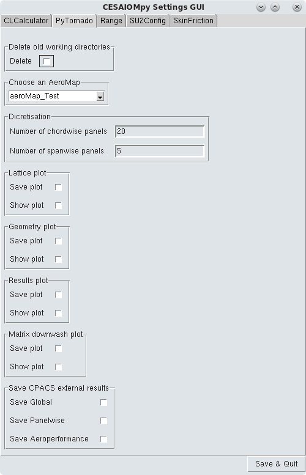

.. _sec_settings_gui:

SettingsGUI
===========

:Categories: Settings, GUI

The *SettingsGUI* provides a simple graphical user interface (GUI) to define settings for each module in a |name| workflow. The SettingsGUI is usually run as the first module in a |name| workflow.

    SettingsGUI interface

Installation
------------

*SettingsGUI* is installed by default with the |name| installation.

Analyses
--------

*SettingsGUI* does not perform any analysis. However, it will use informations contained in all the __specs__ file to create one tab per module. The user can fill all the inputs and when the button "Save & Quit" is clicked on, all the data will be saved at the correct place in the CPACS file.
It can also be used to manage the aeroMaps contained in the CPACS file.

Output
------

The input CPACS_ file will be updated according to the settings in the GUI.

Required CPACS input and settings
---------------------------------

No specific CPACS input is required to run the SettingsGUI editor.

..
    Limitations
    -----------

    TODO

..
    More information
    ----------------

    TODO
