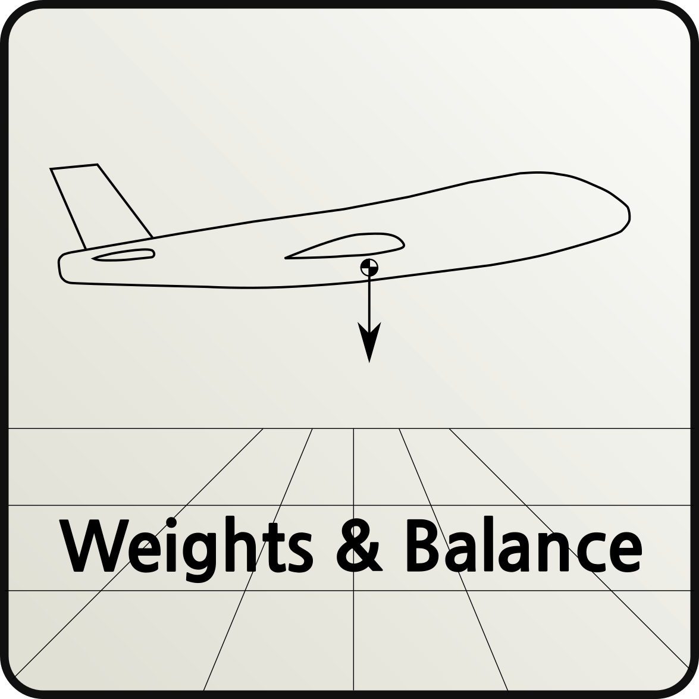

WeightUnconventional
====================

**TODO**  Check all info

Main module for the unconvenentional aircraft class I design, it evaluates:

* the structure mass;
* the systems mass,
* the engine mass;
* the maximum take-off mass;
* the operating empty mass;
* the zero fuel mass;
* the maximum amount of fuel;
* the maximum number of passengers;
* the maximum amount of fuel with max passengers;
* the number of crew members needed;
* the number of toilets.

Starting point:

* CPACS.xml file in the ToolInput folder.

Aircraft types:

* No Fuselage
* Multiple fuselage (Es.: 2 for payload and 1 for fuel etc..)

Output:

* The code saves a ToolOutput.xml file in the ToolOutput folder.
* The code saves a copy of the ToolOutput.xml file inside the
  ToolInput folder of the range and balance analysis.
* The system creates a folder with the aircraft name, and saves inside it
  two txt file and one figure:

    * NAME_Aircraft_Geometry.out: that contains all the information
      regarding the aircraft geometry (only with case B)
    * NAME_Weight_unc_module.out: with all information
                                  evaluated with this code.
    * NAME_mtomPrediction.png: contains the result of the linear regression
      carried on for the maximum take-off mass evaluation.

.. warning::

    The code deletes the ToolOutput folder and recreates
    it at the start of each run.
