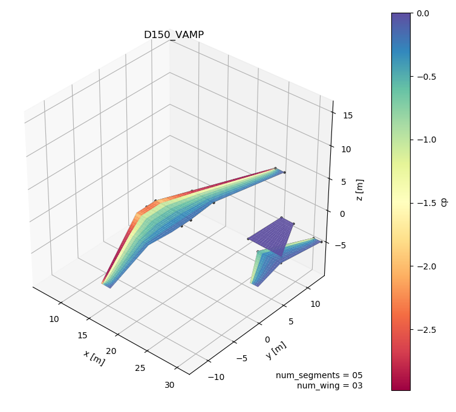

.. _Documentation: https://pytornado.readthedocs.io/en/latest/
.. _documentation: https://pytornado.readthedocs.io/en/latest/

PyTornado
=========

:Categories: | Aerodynamics
             | CFD
             | Aeroperformce maps

PyTornado is an aerodynamics module for fast, low-fidelty aerodynamics analyses. PyTornado is an implementation of the *vortex lattice method* (VLM), a potential flow CFD_ method.

    Example pressure plot

Analyses
--------

PyTornado can evaluate |apms| and write back results.

Limitations
-----------

The VLM is a based on *potential flow*, and classified as a low-fidelity CFD_ method. The aircraft itself is modelled as a collection of flat lifting surfaces. Please refer to the PyTornado documentation_ for more details on limitations.

Requirements and installation
-----------------------------

Currently, PyTornado is an *external dependency*. If you would like to use PyTornado you will have to separately install PyTornado on your system. Please refer to the installation guide for details:

* https://pytornado.readthedocs.io/en/latest/user_guide/installation.html

Required CPACS input
--------------------

To run |name|, a CPACS |apm| is required.

.. hint::

    |Apms| can be created and edited using the *GUI settings editor* (**TODO** link). PyTornado specific settings can also be edited using the settings editor.

More information
----------------

* Documentation_
* https://github.com/airinnova/pytornado
