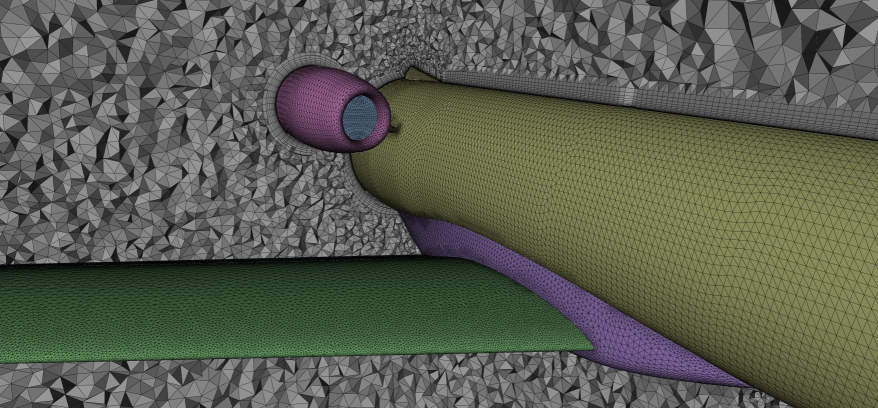
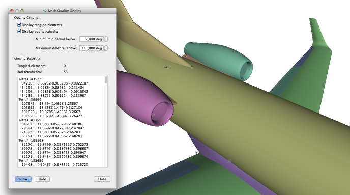
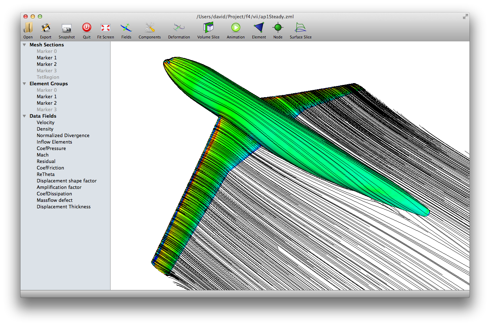
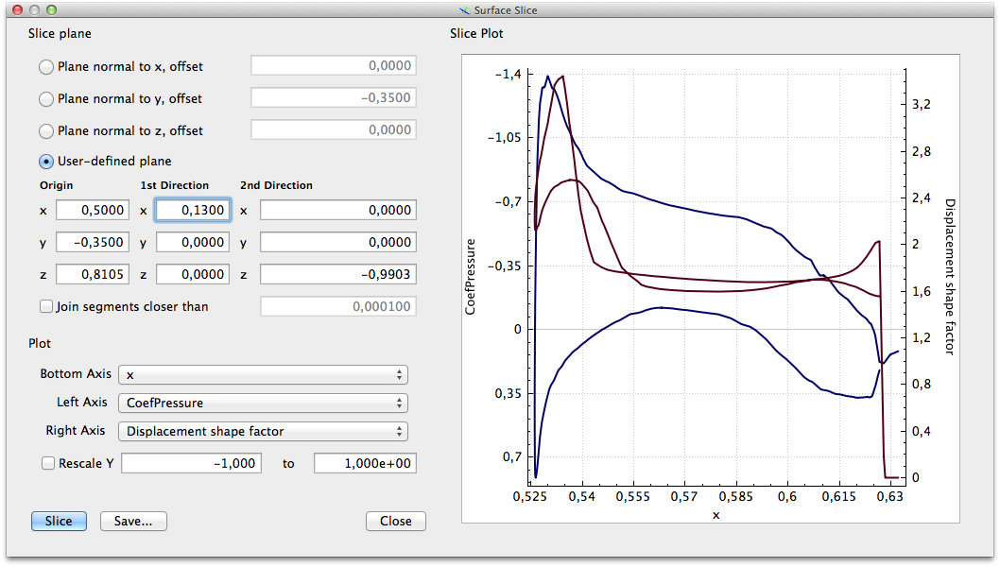
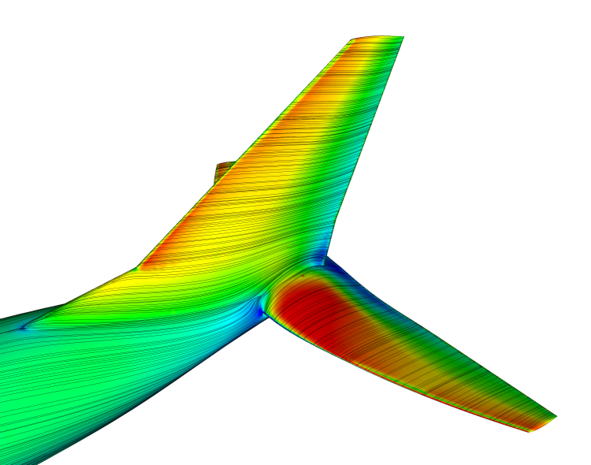
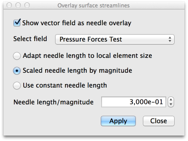
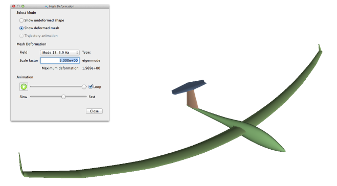
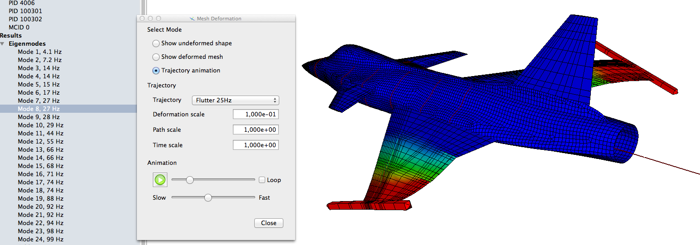
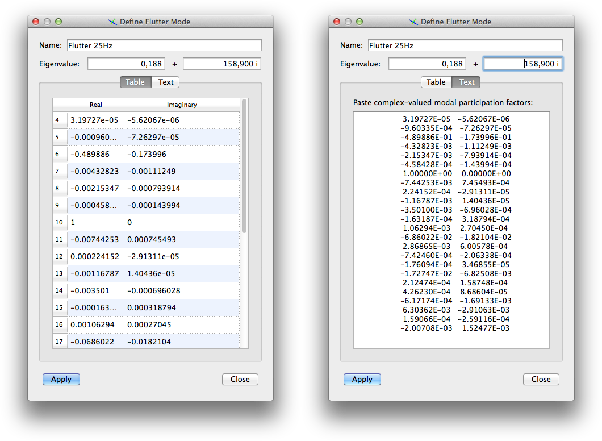

# Data Display

## Inspecting Meshes

Even when only a mesh file (i.e. no computed data) is loaded, scope can still be useful for visualisation. Sections through volume meshes are a quick way to obtain a rough impression of overall mesh quality. For example, the image below shows a two-plane section through a RANS mesh which immediately shows the mesh refinement level in the vicinity of the aircraft body.

{: srcset="../img/ransmesh-fine.png 1x, ../img/ransmesh-fine@2x.png 2x"}

Furthermore, an initial check of element quality is possible using the **Mesh quality** entry in the **View** menu. This function highlights tangled (self-intersecting) volume elements and optionally can locate low-quality tetrahedra as defined by the dihedral angle between faces. 

{: srcset="../img/meshquality.png 1x, ../img/meshquality@2x.png 2x"}

In the example shown, only a moderate number of low-quality tetrahedra are present. Furthermore, these elements do not appear to be located in regions where their presence would be suspected to cause difficulties.

## Scalar Field Data

### Contour Plot

The screenshot below shows a color contour plot of the surface skin friction coefficient computed for the DLR F4 wind tunnel model with forced transition near the leading edges. By default, blue indicates small values and red large magnitudes.

 

Overlayed as thin black lines are surface velocity streamlines on both the body and the wake surfaces which are explicitly present in this particular mesh. 

### Plane sections

Sectional data can be extracted from meshes using the **Surface Slice** function. A plane rectangle is defined in terms of an origin and two direction vectors. Then, data on all mesh surfaces intersected by this rectangle can be shown as a curve plot.   

Two different fields can be shown at the same time. The blue graphs always corresponds to the left y-axis which by default is independent of the red graph (right y-axis). However, when the **Rescale y-axis** checkbox is activated, then both axes are locked to the selected range. This option is useful for the comparison of different solution (flight conditions, frequencies, ...) stored in one and the same file.

In order to generate a section plot, a plane must be defined first. Often, a one of the coordinate planes is desired, for which one of the top three buttons can be used. Limits of the plane rectangle used for slicing the mesh are then computed from the bounding volume of all visible surfaces. Sometimes, these limits are not appropriate for the intended section, in which case the option **User-defined plane** can be selected. Here, the slicing rectangle is defined manually as its origin and two direction vectors.

!!! tip
	A file containing very many subcases can hold hundreds of fields with the same name, 
	e.g. pressure fields for many different flight conditions. To switch between these 
	fields, move the UI focus to the field selection combo box (e.g. **Left Axis**). 
	Now, whenever you click one of the field names in the left-hand side tree view holding
	the subcases, the corresponding field will be selected for slicing. In this way, it is 
	easy to navigate files containing very many solutions. 

Curves shown in the plot window can also be exported. Export to PDF or image formats stores just the plot as an image, while the matlab and plain text options store the plotted data to a file. Note, however, that the data is generated by computing slices of surface elements. Hence, the visible data is not always a single continuous curve, but may consist of multiple segments. 

## Streamlines

Vector fields with at least three components can be displayed as continuous lines on any mesh surface where they are defined. The image below shows skin friction lines generated from the friction coefficient vector stored in a CFD solution file.

{: srcset="../img/frictionlines.png 1x, ../img/frictionlines@2x.png 2x"}

## Hedgehog Vector Plot

Any three-component vector field can also be displayed as a set of simple lines originating at the node where they are defined. This can be useful to check the orientation and magnitude of nodal forces, for which an example is shown in the picture below.

{: srcset="../img/hedgehog-plot-forces.png 1x, ../img/hedgehog-plot-forces@2x.png 2x"}

This type of vector display is named *hedgehog plot* and can be configured using the options in the dialog shown here. For each nodal vector, a thin line (called *needle*) is drawn. The length of these lines can either be the same everywhere or adjusted to the local mesh size for the case where only the direction is of interest. Otherwise, the needle length may also be scaled by the magnitude of the corresponding vectors as was done in the screenshot above.

{: srcset="../img/hedgehog-plot-dialog.png 1x, ../img/hedgehog-plot-dialog@2x.png 2x"}

## Mesh Deformation

Vector fields can also represent deformation fields. When files are imported from structural analyses, such fields are automatically tagged as containing static deformation or eigenvector fields. The mesh deformation dialog allows to display either the deformed mesh by applying a linear scaling factor to the stored deformation field, or to animate the deformed shape. Static deformations are animated as ramping up from the undeformed state to the fully deflected configuration, while modeshapes are displayed as continuous  oscillations.

{: srcset="../img/sailplane-deformed.png 1x, ../img/sailplane-deformed@2x.png 2x"}

## Flutter Modes

Flutter modes are stored in [native format](formats.md#native-format) (.zml) files as a special case of periodic trajectories. Since the format is meant to be rather general, flutter modes are therefore stored as short flight path segments of an elastic aircraft which happens remain at rest. For this reason, they can be displayed by the **Trajectory animation** option in the **Deformation** display dialog. 

As mode shapes are usually normalized in some more or less useful manner, it is very common that the visualization of a deformation shape with default scaling (1.0) looks very exaggerated or does not appear to deform at all. Change the **Deformation scale** factor in order to alleviate this problem. As flutter modes are periodic, the animation feature with the **Loop* option active is recommended. 

### Manual Mode Definition

Even when a flutter problem is solved using an externally provided software, the solution can be displayed with scope. To do so, use the entry **Manually define flutter mode** in the **Loads** menu. In the dialog windows that opens, first name the mode; this is important whenever you want to define multiple modeshapes. Then enter the real and imaginary parts of the complex eigenvalue (in radian per second). Finally, define the modal participation coefficients. This can be done either by filling complex values in a table, or by pasting text from the output of another software as in the second screenshot below.  

When using the text option, scope expects that the participation factors are given in the same sequence as the eigenmodes and as pairs of real and imaginary values. In the above example, the participation factor for the first eigenmode is hence (3.197e-5 - 5.621e-6 i), the second is (-9.603e-4 - 7.263e-5 i), and so on.