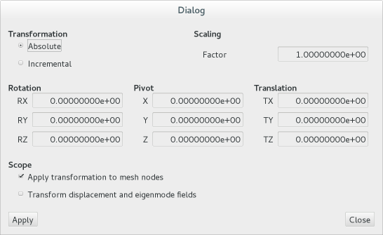

# Editing Meshes

## Coordinate Transformation

All mesh data can be freely transformed into different coordinate systems using the **Transform nodes** entry in the **Edit** menu.

{: srcset="../img/transform.png 1x, ../img/transform@2x.png 2x"}

- **Absolute** indicates that the transformation defined in this dialog is applied to the original, saved geometry, while the **Incremental** settings allows to chain transformations.
- A **Scaling** factor can be defined in order to convert node coordinates between unit systems (scope itself is not aware of units). Note that any secondary data which may be contained in a mesh file, such as material data or boundary condition specification, are not affected by scaling node coordinates.
- A rigid-body **Rotation** around a set **Pivot** combined with a **Translation** can also be defined here. As a convention, the rotation is performed in the order RX-RY-RZ, floolowed by the translation.
- Finally, it is possible to apply the transformation either to mesh nodes, displacement and eigenvector fields, or both. 

!!! tip
    Use the scaling factor and select displacement/eigenmode fields only in order 
    change the scaling of an eigenvector field.
  

## Mesh Size Reduction

In many cases, result files obtained from computational fluid dynamics are very large. Users concerned with flight mechanics, computation of loads, structural analysis or aeroelasticicty are frequently only interested in a very small subset of this data, namely the values of pressure and friction coefficients or local Mach numbers on the surface. Therefore, volume data can often be erased leading to far smaller files, faster load times and much faster workflow.

From the **Components** dialog, mesh sections which are not needed (e.g. all sections containig volume elements) can be erased. Note that this eliminates only the corresponding elements, but neither the nodes associated with these elements nor any field values.

The menu entry **Remove unsused nodes** in the **Edit** menu searches for nodes that are not referenced by any element and eliminates all of these nodes and all field values belonging to them. 
