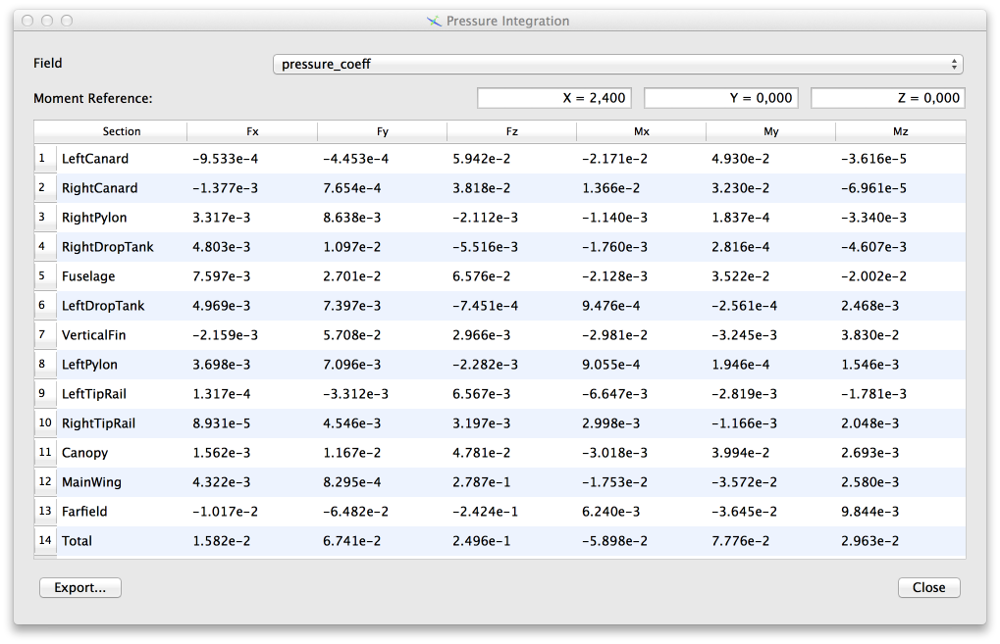
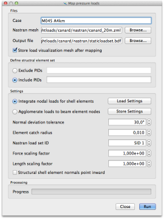
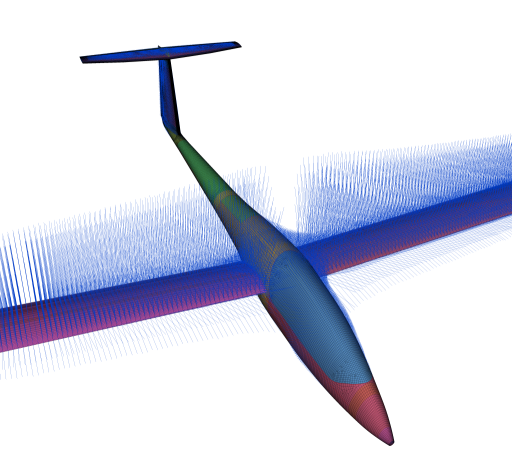
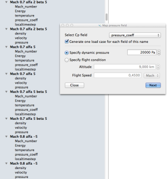

# Generating Flight Loads

Scope can be used to generate structural loads from aerodynamic or aeroelastic solutions. In the simplest case, this process entails just [integration of pressures](#force-integration) over mesh sections. A more useful feature is 
[mapping of pressure](#pressure-mapping) data to a a structural mesh.

!!! note
    The documentation presently only covers simple applications for steady 
    flight loads. More complex (unsteady) loads can be generated, but these options are not properly documented yet.


## Force Integration

To support simple, approximate or preliminary flight load analyses, the entry **Integrate pressure** in the **View** menu allows to select an arbitrary scalar field (usually relative pressures or pressure coefficients) and perform an integration over the surface of each mesh section. This process yields total forces and moments acting on each of the mesh sections assuming reference pressure (the value against which the relative pressure field is offset) on the inside face of the section. 

{: srcset="../img/force-integration.png 1x, ../img/force-integration@2x.png 2x"}

Some CFD codes report absolute pressures, that is, they use vaccum as the reference pressure for the output. In that case, mesh sections which are open to one side - such as the *Canopy* section in the table above - will appear to sustain very large forces. Many times, integrating a pressure coefficient yields more useful results, since the reference pressure is non-zero.

!!! tip
    In the general case, a file containing imported CFD results will include
    external boundaries such as far-field or wind-tunnel walls. The total of 
    forces and moments reported in the last row of the table **includes** any 
    forces acting on these boundaries. The mesh used for the screenshot shown 
    above was reduced by [eliminating](edit.md#mesh-size-reduction) all
    far-field mesh boundaries. 
    
    
## Pressure Mapping 

In order to generate forces and moments acting on a structural model, scope will attempt to integrate a pressure field over each of the selected structural elements. To do so, a number of integration points are created inside each structural shell element. Pressure values for each integration point are determined by looking up the nearest aerodynamic surface element and linearly interpolating the pressure value at the integration point from the nodal values of the aerodynamic element. Surface-integrated pressure loads on the structural element are then expressed as a set of nodal forces and moments which are statically equivalent. These nodal forces are hence not necessarily strictly (Galerkin) consistent. Creating fully consistent loads would require detailed knowledge of the exact shape functions used for each element type by the targeted finite-element solvers.

Often, the structural model will comprise both external shell elements on the wetted surface and internal elements which make up reinforcements, bulkheads and similar structures. Clearly, no pressure integration should be performed on such internal elements. Therefore, it is possible to *exclude* the property IDs (PIDs) of such elements from the pressure integration in the configuration dialog. For the case of a very complex internal structure, it is also possible to instead prescribe the set of PIDs to *include*.

{: srcset="../img/pmap-settings.png 1x, ../img/pmap-settings@2x.png 2x"}

Additional configuration options can be used to control which aerodynamic elements will be found when searching for the pressure values in integration points. This is sometimes necessary when the aerodynamic wetted surface does not exactly match the modelled structural surface, which can happen when, e.g. a structural model is designed to approximate the mean surface of a sandwich structure while the aerodynamic model naturally discretises the outer mold line.

Normal deviation tolerance
: In order to determine pressure from the correct aerodynamic element, only a moderate deviation between the surface normal vector of aerodynamic and structural elements is permitted.

Element catch radius
: Only aerodynamic elements within this distance from the structural integration point will be considered.

Structural shell element normal points inward
: In the case that the structural elements are ordered such that their normal vector direction points into the aircraft interior, this option should be enabled. Note that the structural model must consistently use one convention (all normals pointing either inward or outward) in order for the force integration to provide meaningful results. Elements belonging to excluded PIDs are not used and do not need to comply with that rule.

Load/store settings
: The content of the entire dialog can be saved to and later reloaded from a plain configuration file that may also be edited manually. When moving such configuration files between computers, be aware that the settings even contain file names which may need to be adapted.

Store load visualization mesh
: When this box is checked, scope will open a file dialog where you can enter the name of a file to write force visualisation results.


### Visualisation

The file written for visualisation contains the structural mesh and one or more nodal force vector fields. Use the [hedgehog vector plot](display#hedgehog-vector-plot) option to check orientation and relative force vector magnitudes.

{: srcset="../img/hedgehog-plot-forces.png 1x, ../img/hedgehog-plot-forces@2x.png 2x"}


### Coverage

The pressure integration approach implies that any components which are not represented as shell elements in the structural model will not carry any pressure loads either. When, for example, an externally carried sensor pod is only modelled as a concentrated inertia or using a beam simplification, scope will not compute any aerodynamic forces for the pod. If such a part is included in the aerodynamic model, it is recommended to determine an approximate force and moment pair for the entire body from the mesh section [force integration](#force-integration) described above and explicitly add a point load to the structural model.

!!! note
    Integration of aerodynamic pressure over structural elements is meant to generate a
    load set which yields accurate local deformations, e.g. the change of chord-wise 
    airfoil sections due to pressure loading. The approach is hence built upon the 
    assumption that the aerodynamic and structural mesh are, in some sense, close to each 
    other. Using aerodynamic and structural configurations with, for example, different 
    aileron deflections will very likely fail to generate useful load sets.

### Accuracy 

Sometimes, the mesh density of a structural model is selected from purely structural considerations without regard to the possible variability of an external pressure field. In rare cases with very large structural elements in regions where the pressure changes very rapidly over short distances, this can lead to under-sampling, in which case the sum of structural forces differs substantially from integrated aerodynamic loads. 

!!! tip
    When the structural model is suspected to contain regions with elements that 
    may be too coarse to resolve expected pressure loads, perform additional checks: Use
    the [force integration](#force-integration) feature to compute 
    integrated forces on the aerodynamic model and compare the sum with the
    force total reported by the structural solver.


## Force Agglomeration for Beam Models

Structural models made up of beam elements can naturally not be used in the pressure integration approach described above, since there is no geometric representation of the wetted surface. Selecting the **Agglomerate loads** option in the configuration dialog shown above will switch to a different algorithm.

Every aerodynamic surface element is assigned to the geometrically nearest beam element node. The forces and moments generated by the selected pressure field acting on every aerodynamic element are then applied to the corresponding beam node as if the aerodynamic element was attached to that node through a rigid connection.  

In contrast to the [integration approach](#coverage), the agglomeration method will always automatically account for all aerodynamic loads. However, the location of load introduction will frequently not be accurate as aerodynamic pressure loads are in reality often not transferred to the *nearest* structural member. This inaccuracy can sometimes lead to large local deformations when weak secondary structures are erroneously subjected to accumulated pressure loads.

For very approximate structural models that do not match the aerodynamic surface well, and containing different elements topologies which need all be loaded, it is possible to abuse this algorithm in order to obtain a coarse load approximation. Note that only beam element nodes will be used as load introduction points in this case.

## Handling Multiple Cases

It is common that a large number of flight conditions need to be evaluated. Scope simplifies this process by allowing the efficient handling of multiple aerodynamic solutions and [reduction](edit.md#mesh-size-reduction) of large CFD meshes to extract wetted surface data. Using a file containing multiple aerodynamic solutions, the pressure integration of force agglomeration method can be automatically applied to all load cases where the pressure field to use in the mapping has a certain name (such as 'pressure' or 'CoefPressure'). 

{: srcset="../img/pmap-multicase.png 1x, ../img/pmap-multicase@2x.png 2x"}

To define a sequence of dissimilar load cases from multiple aerodynamic solutions, two different approaches can be taken. First, it is possible to define a single flight condition or dynamic pressure when setting up the load mapping. This would then be combined with the selection of a field which contains the coefficient of pressure to be multiplied with the given dynamic pressure to yield differential pressures. Second, the dynamic pressure can be set to one and differential (or absolute) pressure fields selected to compute nodal forces. In this way, it is possible to handle many different flight conditions using just one file.


## Load Output 

At the time of writing, scope is limited to writing output files for NASTRAN. These are plain-text bulk data files which contain nodal force and moment values for each of the load sets defined in the procedure described above. the beginning and end of a single bulk data file with 64 load sets will look similar to this example:

````
FORCE, 1, 3001, 0, 1., 0.023789, -0.11727, -0.09527
MOMENT, 1, 3001, 0, 1., -3.10E-3, 0.00371, -0.49E-2
FORCE, 1, 3002, 0, 1., 0.016238, -0.08964, -0.0995
MOMENT, 1, 3002, 0, 1., -0.50E-2, 0.004862, -0.46E-2
...
FORCE, 64, 210255, 0, 1., 0.112499, -0.53E-3, -1.0393
MOMENT, 64, 210255, 0, 1., 0.835E-4, -0.50E-2, 1.213E-6
FORCE, 64, 210256, 0, 1., 0.022947, 0.002875, 0.81012
MOMENT, 64, 210256, 0, 1., 0.388E-3, 0.003237, -2.47E-5
````


## Limitation

Sometimes, thin shell structures are modelled as a single element layer. The force integration procedure in scope is not designed for this kind of simplified model and will fail to produce reasonable structural loads. It is, however, still possible to use such models for the mapping of displacements from the structural to the aerodynamic surface. Since some methods use the transpose of the displacement mapping for the purpose of transferring loads, such methods may still be feasible. There is, however, no support for this approach in the user interface.