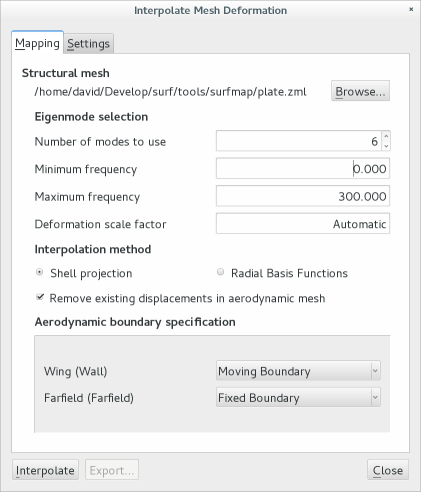
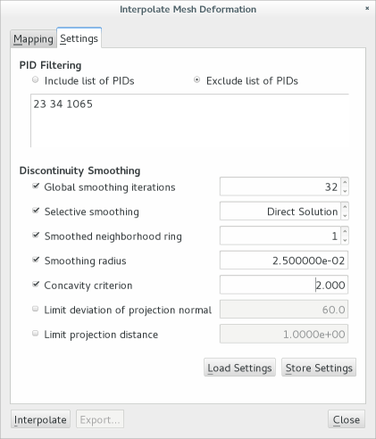
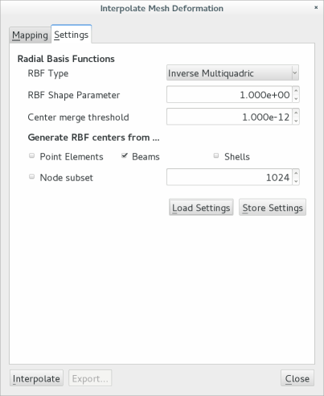

# Mapping Mesh Deformation

Scope can be used to map surface deformations from a structural model to boundary surfaces of an aerodynamic mesh. Typically, this operation is a step needed to allow an aerodynamic solver to handle deforming bodies.

On the aerodynamic side, there are two fundamentally different approaches to handling surface deformation. The simpler method is to approximate the effect of surface displacement by defining a transpiration mass flow through the surface which, in the infinitesimal limit, has the same effect as the boundary displacement itself. This method is often very robust, but can only be used for small deformations. For instance, it is usually accurate for the modelling of elastic deformation, but may not be suitable to account for the effect of a landing flap deflection.

!!! note
    Transpiration boundary conditions imply a linearization and should   
    therefore be insensitive to scaling - solving an aerodynamic problem 
    perturbed by small transpiration term is intrinsically linear and should
    therefore be a numerically *easier* task with better convergence
    properties. 

The second approach is to account for the full body deformation during an aerodynamic analysis, that is, by updating the aerodynamic mesh according to either some prescribed motion or a coupled analysis. This method often relies on surface deformation fields as a stepping stone to compute displacements of nodes in the fluid domain. Scope does not compute volume mesh deformations itself, but only surface mesh deformations.

## Prerequisites

In order to map mesh deformations correctly, both the structural and the aerodynamic mesh need to be defined in the same coordinate system. See the topic on [Mesh Transformation](edit.md#coordinate-transformation) on how this can be accomplished.
 
!!! note
    It is very common that structural (mm) and aerodynamic models (m) are
    defined in different units. It is suggested to load the structural model 
    into scope first and store the unit-converted file in the 
    [native file format](formats.md#native-file-format), which has the added 
    advantage of shorter load times than NASTRAN result files.
    
When importing modal data from NASTRAN, it is recommended to use output in punch file format (.pch files). Often, .f06 files can also be imported, but the punch file format is more robust and will likely work better. To write out eigenvector shapes into a PUNCH format file, use the following commands in the case control section:

`````
DISPLACEMENT(PUNCH) = ALL
ECHO(PUNCH) = SORTED
````` 
    
## Basic Usage

Once the two meshes are available in compatible units and coordinate systems, the deformation mapping process can be performed as follows:

{: srcset="../img/meshdeform1.png 1x, ../img/meshdeform1@2x.png 2x"}

1. Load the aerodynamic mesh first. This is the mesh for which the surface motions will be computed.
2. Select the menu item **Map structural deformation** in the **Loads** menu.
3. In the dialog (shown below), select the structural mesh file. This can be a NASTRAN result file (punch file .pch preferred) or a native format file (.zml).
The structural mesh will *not* be shown in the main window.
4. Decide how many eigenmodes to map. This can be specified as a number of modes or a frequency range of interest.
5. Optionally change the [scaling of the deformation modes](#deformation-scaling). 
6. For structural models defined by shell and solid elements, use the shell projection method; for beam models, use interpolation by radial basis functions.
7. Select which aerodynamic boundaries will be treated as deforming (moving) and which are to be held fixed. Aerodynamic meshes which contain well-defined boundary conditions (CGNS, native format) will try to guess which aerodynamic boundaries are to be deformed. 
8. Optionally, adjust internal algorithm settings on the **Settings** page.
9. Start the interpolation process by clicking **Interpolate**.

!!! tip
    When using very large meshes, try out the process with a few modes first to
    check whether results are acceptable. Processing of hundreds of modes on
    large meshes can take a long time. (Large meshes are thoise with many
    nodes on the aerodynamic surfaces.)

One the interpolation has been completed, the tree view on the left-hand side shows additional entries for the new deformation fields which are now present in the aerodynamic mesh currently in memory. You can now review the quality of the deformed meshes by using the [deformation display](display.md#mesh-deformation) option.

Acceptable mesh deformation fields can be exported to the aerodynamic solver either by saving the current mesh (which now contains new fields) in a format which is understood on its own, or storing the deformation fields as separate files. A common application is the computation of boundary displacement files (.bdis) for the EDGE flow solver - one file per mode. These .bdis files can be created directly from the **Export** button in the deformation mapping dialog 

!!! tip
    Save the aerodynamic mesh including boundary deformations in the native file format (.zml) for later reference. It is always possible to extract the .bdis files from this format at a later time.

## Advanced Usage

Advanced settings can be acessed on the **Settings** page to he right of the intially opened **Mapping** tab. Because of the different algorithms, these settings differ between the mapping methods (projection or RBF). In any case, scope attempts to select reasonable default values which depend on the dimensions of the aerodynamic mesh.

In both cases, any settings adapted here can be stored to a file which is compatible with the [surfmap](#command-line-tool) command-line utility. Alternatively, advanced settings can also be imported from such a file using the **Load Settings** button on the second page.

### Projection

The shell projection method works by iterating over aerodynamic surface nodes and finding the nearest structural element. This method is strongly recommended for
applications in aeroelasticity because it generates aerodynamic mesh deformations
which are much closer to the structural model behavior.

{: srcset="../img/meshdeform2.png 1x, ../img/meshdeform2@2x.png 2x"}

The first field permits to define a set of elements property IDs (PIDs) which should be included in or excluded from the set of structural elements used for projection. This option is useful to excluding structural components which are not relevent for aerodynamic modeling. 

The remaining options all concern the detection and handling of discontinuous deformations:

Global smoothing iterations
:  Apply *n* Laplacian smoothing iterations on the entire aerodynamic surface. 
   This indiscriminately smoothes all deformation gradients is therefore
   disabled by default.
   
Selective smoothing
:  Enable identification of aerodynamic elements which are located near a 
   possible discontinuity. Deformation fields will only be smoothed out over 
   these specific elements, which is much more selective than the global option
   described above. Leaving this option as **Direct Solution** will not 
   perform iterative Laplacian smoothing, but rather solve a sparse linear
   system to obtain the displacement of aerodynamic nodes near structural
   discontinuities.
    
Smoothed neighborhood ring
:  This specifies the size of the topological neighborhood to include in the 
   smoothing set. Switching this option off will apply the smoothing only to 
   aerodynamic nodes which are par of elements that stretch a discontinuity.
   Selecting **1** will include all immediate neighbor nodes, **2** will also 
   include the neighbors of neighbors, and so on.
   
Smoothing radius
:  Since aerodynamic surface elements can be extremely small in some regions
   such as sharp leading edges, it is also possible to specify the size of the 
   neighborhood of a discontinuity to be smoothed in terms of a distance. If 
   both this and the topological ring are active, then the boolean union of both
   sets is included in the smoothing procedure.
   
Concavity criterion
:  Rather often, discontinuities in structural displacements occur along seams
   where two or more structural components are joined by means of some number of
   fastening elements. Between fasteners or attachment fittings, the  structural
   parts are free to move against (or even, in linear analyses, through) each 
   other. Aerodynamic fairings, flexible tape or putty that covers such seams is
   usually not included in structural models. The concavity criterion is used to
   to automatically identify aerodynamic elements which stradle such seams in
   structural model (regions of concave surface curvature). Selecting a smaller 
   value will mark more aerodynamic elements. A value near 1.0 will almost 
   certainly include the entire aerodynamic mesh in this set.
  
### Radial Basis Functions

The RBF method works in a fundamentally different manner. Instead of using structural element information, a set of globally defined interpolation functions is defined. These value of these functions depends only on the radial distance of a node to all of the RBF center points. RBF have therefore a rather strong smoothing effect and can unfortunately generate grossly unrealistic displacements for aerodynamic nodes which are far from a structural nodes selected as RBF centers. 

RBF centers are always obtained from the structural model. In regions without structural nodes, there will be no RBF centers and accuracy may degrade considerably. 

{: srcset="../img/meshdeform3.png 1x, ../img/meshdeform3@2x.png 2x"}

RBF Type
: Here, the [type of radial basis function](https://en.wikipedia.org/wiki/Radial_basis_function) 
  can be selected. The inverse multiquadric RBF has earlier 
  been found to show satisfactory properties for use with beam models.
  
RBF shape parameter
: Some types of RBF contain a free parameter (called epsilon or beta) which can
  be set here. Sometimes, the degree of smoothing generated by a certain form of
  RBF is influenced by this parameter.
  
Center merge threshold
: Most structural models contain duplicate nodes, but duplicate RBF centers serve
  no purpose. The value selected here is used to fuse near-coincident structural 
  nodes in order to improve the conditioning of the RBF construction problem.
  
RBF center selection
: The RBF interpolation method is most useful for simple structural models with 
  some hundreds of beam elements. Such models are topologically dissimilar from 
  aerodynamic meshes and hence require some sort of extrapolation in any case. 
  However, this option permits to create RBF interpolations even from models 
  containing shell elements.
  
Node subset
: By default, each and every structural node which is part of of the selected 
  element types will be turned into a RBF center. This results in an RBF set which
  exactly interpolates the strcutural deformation fields in the structural nodes
  and has good accuracy near those nodes. However, constructing the RBF 
  representation requires the factorization of a large dense matrix, which becomes
  rather time- and memory-consuming when exceeding about 4000 RBF centers. For 
  such cases, it is therefore better to select only a subset of nodes, the 
  size of which is defined here, and solve a least-squares problem instead. With
  very large structural models containing millions of nodes, the number of RBF 
  nodes must be reduced to around 1000 or below.
  


### Deformation Scaling

Depending on the aerodynamic solver or its preprocessing facilities, it may be necessary to select some small scaling factor in order to prevent mesh deformations becoming too large. Sometimes, large surface mesh deformations may in themselves be acceptable, but lead to problems such as ill-defined deformed volume elements at a later stage of the analysis.

An overall scaling factor for all modeshapes can be chosen in the dialog shown in the section on [Basic Usage](#basic-usage) above. Select a scaling factor of 1.0 to obtain aerodynamic deformation fields which have the same amplitude as structural modes - this is usually a good choice for aerodynamic solvers which use the transpiration method.  

##  Command-Line Tool

All deformation mapping operations which are available in the graphical user interface from within acope can also be accessed through the command line utility **surfmap**. In this case, the algorithm parameters are set by means of a plain text configuration file. A simple example is shown here:

````````
#  The case name is optional. If given, output files will be named with the case
#  name as prefix.  
Case = config-3c

#  Mandatory file names
StructuralMesh = plate.zml
AeroMesh = afine.zml

#  Select interpolation method, options are RBF, a radial basis function 
#  interpolation or Projection, meaning projection on shell elements 
Method = Projection
GalerkinAveraging = true
OutputFormat = zml

#  A list of names of moving mesh boundaries.
MovingBoundaries = Fuselage, Canopy, MainWing, Stabilizer, Fin

#  A list of sliding boundaries.
SlidingBoundaries = XZSymmetryPlane

#  Eigenmode selection.
MaxFrequency = 85.0
MaxModeCount = 200

#  Let surfmap determine scaling factors
AutomaticScaling = true

#  Algorithm options for projection method
ExcludePID = 37 38 39 42 77 78 79 87 88 89 90 12 4 14 91
WriteProjectionSurface = false
PostSmoothing = -1
SmoothingRadius = 0.01
SmoothingRing = 1
```````` 

In the following sections, all available configuration parameters for surfmap are listed with a short explanation. 

### Common options

Case 
:  The case name is optional. If given, output files will be named with the case
   name as prefix. Without a case name, the default output file name is "mapped"
   plus a corresponding suffix.

Method 
:  Select interpolation method, options are **RBF**, a radial basis function 
   interpolation, or **Projection**, meaning projection on shell elements.
   Setting this entry to **ApplyH** loads a previously generated H-matrix from 
   a file and re-applies that matrix to the meshes a specified below. Naturally,
   the file containing the matrix must be specified with **HMapFile** described 
   below.

OutputFormat
:  Optionally, select format for the output. zml means that one native format
   file is written for visualization in scope; bdis means that one surface
   displacement file is written for each mode, for use with the EDGE 
   aeroelastic toolchain. Multiple formats can be given.

StructuralMesh
:  File containing the structural mesh and modal displacement data. This can 
   be a zml file written by (e.g.) scope or a NASTRAN punch data file for a modal 
   solution (SOL 103).

AeroMesh :  File containing the aerodynamic mesh. 
:  This can be either a zml file written by scope or sumo, or a bmesh file for 
   use with EDGE. If a bmesh file is given, then bdis output is 
   enabled automatically.

MovingBoundaries:  A list of names of moving mesh boundaries.
:  The boundaries named below are treated as lying on surfaces which should move
   in accordance to structural displacements. Nodes on these boundaries will 
   be displaced. If this list is not provided, then all boundaries marked with 
   wall boundary conditions are selected automatically. Since bmesh files do not
   contain boundary condition specifications, this entry is required for bmesh
   files.
 
SlidingBoundaries: A list of sliding boundaries.
:  Nodes on these boundaries are restricted to move in the plane defined by the 
   first element of each boundary. Hence, listing a sliding boundary is only 
   useful for boundaries which are entirely plane, making it useful only for
   symmetry planes.

MaxModeCount, MinFrequency, MaxFrequency
:  If the displacement mapping is to be performed for a subset of modes only,
   this subset can be defined by specifying a frequency interval and a maximum
   number of eigenmodes to use. If not given, then all eigenmodes present in 
   the structural input will be processed.

AutomaticScaling
:  When switched on, surfmap attempts to determine displacement scaling factors
   so that the deformed aerodynamic surface mesh does not contain any degenerate
   (badly rotated, inverted) triangles. Due to the algorithm used in this test,
   only triangular aerodynamic surface elements are considered. Note that the
   factors found in this way are not a guarantee that a volume mesh deformation
   procedure will successfully complete.
   Default is 'false'.

### Options for the projection method

IncludePID:  List of shell PIDs to include.
:  Elements with these shell property IDs will be used as the set of elements on
   which to project aerodynamic nodes for interpolation. Often, it is more useful
   to specify the opposite, namely PIDs to exclude from the projection set. If 
   this option is not given, then projection on all shell elements in the 
   structural model is permitted. 

ExcludePID 
:  Elements with any of these property IDs will *not* be used to define the 
   projection surface. This list can be employed to address problems occurring
   when aerodynamic nodes happen to be projected on shell elements which are 
   part of some internal structure or reinforcement. The use of the
   options ExcludePID and IncludePID is mutually exclusive.

WriteProjectionSurface : Write the projection surface to file.
:  Setting this to true will generate a file (for use in scope) which contains
   only the structural shell elements used to define the projection surface. It 
   is a good idea to enable this option when the PID-based selection described 
   above is active, so that the list of active shell elements can be verified.

HMapFile : Store/load mapping from file
:  When **Method** is set to **ApplyH**, then the H-matrix to be used is loaded
   from the file named here. If **Method** is **Projection**, then the H-matrix
   is computed and stored in this file. 

###   Handling of discontinuities.
   
PostSmoothing
:  Setting PostSmoothing to *zero* disables any postprocessing of interpolated 
   deformation, which is useful when surface deformations for transpiration 
   boundary conditions are needed. 
   A positive number for PostSmoothing enables approximate smoothing by means of
   a number of discrete Jacobi iterations, where the value of PostSmoothing 
   (say 4 to 30) indicates the number of iterations to perform. Note that this
   method is most appropriate if the size of aerodynamic elements in the vicinity
   of discontinuities is approximately equal.
   Set PostSmoothing to -1 to replace the iterative smoothing method with the 
   exact solution of a diffusion problem, where the deformations for all elements
   recognised as being near a discontinuity are determined from interpolated 
   deformations in the region around those elements. This approach works well 
   even with significant size differences between aerodynamic elements in the 
   discontinuous displacement region.   
  
SmoothingRadius : Catch radius around discontinuities. 
:  First, all aerodynamic elements which stretch across structural component
   boundaries (where structural deformations can be non-smooth) are found. It is,
   however, possible that some of these elements, e.g. at the leading edge, are 
   very small. Smoothing deformations over just these few small elements may 
   therefore still generate undesirable mesh irregularities. Setting the 
   smoothing radius to non-zero values includes all aerodynamic nodes which are
   within this distance from any of the already identified candidate nodes in the
   set of nodes to which the smoothing defined by PostSmoothing is applied.

SmoothingRing : Topological ring around discontinuities.
:   An alternative way of including more aerodynamic elements in the smoothed set
   is to specify a topological neighbourhood. Setting this option to 0 disables,
   1 means all neighbour elements, 2 neighbours-of-neighbours and so on.

  
### Options used for RBF interpolation only
  
UsePoints, UseBeams, UseShells : Structural node selection options.
:  These three options allow to specify which structural nodes are to be 
   used to define center points for the radial basis functions. Structural 
   displacements will be interpolated exactly at these center points. The 
   computational work required to define the RBF basis increases very quickly 
   with the number of centers, so that more than a few thousand centers should
   usually be avoided. In particular, the RBF method is not suitable for use
   with detailed shell models with many nodes. The default is to collect only 
   nodes on beam elements.

MergeThreshold : Center merge tolerance.
:  The RBF method can fail for models which contain multiple nodes at the same
   geometric location, which is common in structural models with mechanisms. This
   option can be used to merge closely spaced RBF centers so as to improve the
   robustness of the method. The default value is 1e-12.  


