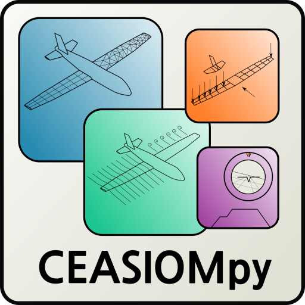

[](https://github.com/cfsengineering/CEASIOMpy/actions/workflows/unittests.yml)
[](https://github.com/cfsengineering/CEASIOMpy/actions/workflows/integrationtests.yml)
[](https://codecov.io/gh/cfsengineering/CEASIOMpy)
[](https://www.codacy.com/gh/cfsengineering/CEASIOMpy/dashboard?utm_source=github.com&amp;utm_medium=referral&amp;utm_content=cfsengineering/CEASIOMpy&amp;utm_campaign=Badge_Grade)
[](https://github.com/psf/black)
[](https://github.com/cfsengineering/CEASIOMpy/blob/main/license.md)

> ⚠️ **WARNING**  
> LICENSE CHANGE NOTICE (2026): This project has transitioned from an open-source license to a Proprietary License. Use of this software is now restricted to evaluation and academic research; all commercial use, Cloud, or HPC deployment requires a separate agreement from CFSE. Please refer to the license.md file for full terms and contact information.

For the legacy open-source version, please refer to all [v1.x] versions.

# CEASIOMpy



CEASIOMpy is an conceptual aircraft design environment which can be used to set up complex design and optimisation workflows for both conventional and unconventional aircraft configurations.

CEASIOMpy is mostly written in Python but it also depends on third-party libraries and software (like [SU2](https://su2code.github.io/) for the CFD calculation).

All input geometries are based on the open-standard format [CPACS](https://www.cpacs.de/), a *Common Parametric Aircraft Configuration Schema*. It uses a parametric definition for air transportation systems which is developed by the German Aerospace Center [DLR](https://www.dlr.de/).

:scroll: CEASIOMpy is maintained by [CFS Engineering](https://cfse.ch/).

:book: The Documentation of CEASIOMpy is integrated in this repository and can be read in documents like this one. Follow links to find the information that you are looking for.

## Table of contents

- [Table of contents](#table-of-contents)
- [Installation](#installation)
  - [Linux/macOS](#linuxmacos)
  - [Run CEASIOMpy](#run-ceasiompy)
- [Available modules](#available-modules)
  - [Geometry and Mesh](#geometry-and-mesh)
  - [Aerodynamics](#aerodynamics)
  - [Mission Analysis](#mission-analysis)
  - [Structure](#structure)
- [Contributing](#contributing)
- [More information](#more-information)
- [Cite us](#cite-us)

## Online Version (in development)

Visit: https://ceasiompy.com for an overview of what this repository has to offer.

## Installation

### Linux/macOS

On Linux/macOS, run the installer to set up the conda environment and optional tools (some scripts are still under development):

```bash
git clone https://github.com/cfsengineering/CEASIOMpy
cd CEASIOMpy
./scripts/install.sh
```

For Windows users please use the online version at https://ceasiompy.com or go to the [Docker Installation page](https://github.com/cfsengineering/CEASIOMpy/blob/main/installation/docker_installation.md).

### Run CEASIOMpy

- **Build a custom workflow**
    ```bash
    ceasiompy_run --gui
    ```

- **Specify a default geometry to load**
    ```bash
    ceasiompy_run --gui --geometry geometry/cpacsfiles/d150.xml
    ```

- **Specify geometry + modules**
    ```bash
    ceasiompy_run --gui --geometry geometry/cpacsfiles/d150.xml --modules pyavl
    ```

- **Help**
    If you want the list of all possible commands for ceasiompy:

    ```bash
    ceasiompy_run --help
    ```


### Available modules

There are many different modules available in CEASIOMpy that can be combined to create different workflows.

#### Geometry and Mesh

- [Add Control Surfaces](src/ceasiompy/addcontrolsurfaces/readme.md)
- [CPACS to GMSH](src/ceasiompy/cpacs2gmsh/readme.md)

#### Aerodynamics

- [AVL low-fidelity solver](src/ceasiompy/pyavl/readme.md)
- [SU2 high-fidelity Solver](src/ceasiompy/su2run/readme.md)

#### Meta modules

- [Surrogate Model Module](src/ceasiompy/smtrain/readme.md)

#### Mission Analysis

- [Static Stability](./src/ceasiompy/staticstability/readme.md)

#### Structure

- [Aeroframe](./src/ceasiompy/aeroframe/readme.md)

## Contributing

We welcome contributions from everyone. If you want to contribute to the development of CEASIOMpy, please read the document [contributing.md](contributing.md).

## More information

- [CEASIOMpy YouTube channel](https://www.youtube.com/channel/UCcGsFJV29os1Zzv66YKFRZQ)
- [CFS Engineering](https://cfse.ch/)
- [Airinnova](https://airinnova.se/)

## Upgrading environment

Sometimes deleting cache helps.

```bash
sudo find . -name "__pycache__" -type d -prune -exec rm -rf {} +
find . -name "*.pyc" -type f -delete
```

Or upgrading the environment.

```bash
conda env update -f environment.yml
```

## How to Cite

This respository may be cited via BibTex as:
```bash
@software{ceasiompy2026,
  author = {CFS Engineering},
  title = {CEASIOMpy: Conceptual Aircraft Design and Optimization Framework},
  year = {2026},
  url = {https://github.com/cfsengineering/CEASIOMpy},
  note = {Proprietary License - Commercial/HPC use requires authorization.}
}
```

## Code Developers
We are the **CFS Engineering** team, we are a:

* **Who we are:** specialized company in **Computational Fluid Dynamics (CFD)**.
* **Where we are:** based at the **EPFL Innovation Park, Lausanne**, Switzerland.
* **Our heritage:** active since the late '90s, we have built a massive background in aerodynamics and aerothermodynamics.

We are the creators of **NSMB** (Navier-Stokes Multi-Block), our robust and widely used in-house code. If you want to dive deeper into our history, feel free to [visit our website](https://www.cfse.ch).

**Best regards,**
**The CFS Engineering Team**
*Lausanne, Switzerland*

> © 2026 CFS Engineering | EPFL Innovation Park, 1015 Lausanne.
