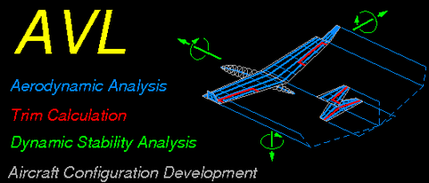

# AeroFrame

**Categories:** Aeroelasticity, vortex lattice method, linear beam theory.

**State**: :heavy_check_mark:

`AeroFrame` module allows to perform low-fidelity steady aeroelastic calculations. It couples the [Athena Vortex Lattice (AVL)](https://web.mit.edu/drela/Public/web/avl/) solver used in `PyAVL` module and [FramAT](https://framat.readthedocs.io/en/latest/). A finite element method implementation of the linear beam equations are combined with the vortex lattice method to compute the wing deformation under specific steady flight conditions.

## Inputs

`AeroFrame` takes as input a CPACS file, the aircraft geometry is read to create the VLM model for the main wing. The flight conditions have to be defined within an aeromap, as well as the number of vortex panels to use. The structural and cross-section properties need to be specified for the use of the structural model.

## Analyses

`AeroFrame` first computes the aerodynamic forces acting on each wing panel, which are given to the structural model to compute the deformation. This deformation results in an new geometry used to compute the updated aerodynamic forces. This iterative process continues until the wing deformation achieves convergence, or stops if the maximum number of iterations is reached.

## Outputs

`AeroFrame` outputs a CPACS file with all the structural parameters and wing tip deflection written. In addition, the following files are saved at each iterations:
- All AVL forces outputs, see [`PyAVL` documentation](../PyAVL/README.md) for more details.
- `deformed_wing.png` : plot of the deformed wing shape compared to the undeformed one.
- `structural_mesh.png` : plot of the structural nodes and vortex lattice panels.
- `translations_rotations.png` : plot of the results of the structural model (translations and rotations) along the wing span.
- `deformed.csv` : details of the structural model (coordinates, forces, cross-section...) of the deformed wing.
- `undeformed.csv` : details of the structural model (coordinates, forces, cross-section...) of the undeformed wing.

At the end of the calculation the convergence of the wing tip deflection as well as the residual are plotted in `deflection_convergence.png`. 

## Installation or requirements

Following the automatic installation procedure on the [CEASIOMpy installation page](../../installation/INSTALLATION.md) should install `AeroFrame` automatically with the other tools.

## Limitations

`AeroFrame` uses a Vortex Lattice Method solver coupled with linear beam equations:
- The flow is quasi-steady and ideal: incompressible, irrotational, and inviscid.
- The flow is low-subsonic: [Prandlt-Glauert transformation](https://en.wikipedia.org/wiki/Prandtl%E2%80%93Glauert_transformation) is used to adapt the equations up to Mach 0.6.
- Lifting surfaces are assumed to be thin, the thickness is not taken into account.
- The angle of attack and sideslip must be small.
- Viscous effects, turbulence or boundary layer phenomena are not solved at all.
- Displacements and rotations should be small.
- The cross-section of the wing is assumed infinitely rigid on its own plane, and remains planar after deformation.

## More information

- [AVL documentation.](https://web.mit.edu/drela/Public/web/avl/AVL_User_Primer.pdf)
- [AVL website.](https://web.mit.edu/drela/Public/web/avl/)
- [FramAT documentation.](https://framat.readthedocs.io/en/latest/)
