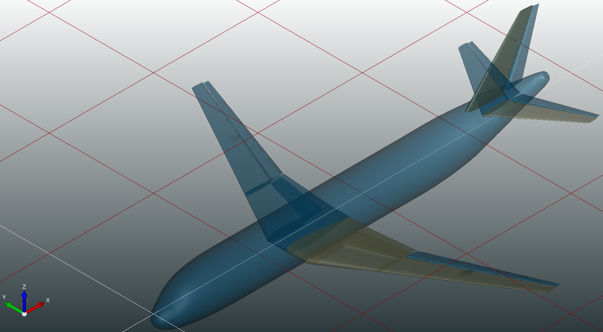
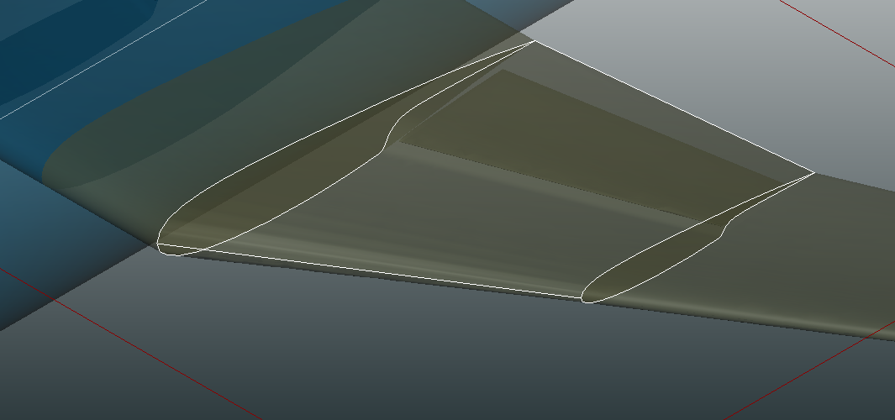
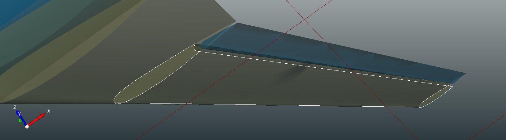

# CPACSUpdater

**Categories:** CPACS modifier

**State**: :heavy_check_mark:

## Important

CPACSUpdater expects that your CPACS file is "correct" and that all informations regarding positionings and sections are detailed (e.g. from_section_uid and to_section_uid).

## Inputs

'CPACSUpdater' needs a CPACS file to modify.

## Analyses

'CPACSUpdater' computes nothing.

For each wing segment, you can choose which type of control surfaces to add in CEASIOMpy's GUI.

Fowler flap:

Essentially 'CPACSUpdater':
    1. Copies and scales original wing to make the flap.
    2. Crops the original wing to make place for the flap.

Plain flap/rudder/aileron: It is important to specify the correct type of control surface if you are going to deform them in the future.

Essentially 'CPACSUpdater':
    1. Chooses a point in x to divide the main wing in two parts.
    2. Then uses a sin function to close these two parts.

Please call 'CPACSCreator' after calling 'CPACSUpdater' to check if your CPACS file has been correctly modified.

## Outputs

Modified CPACS file with control surfaces.

## Installation or requirements

CPACSUpdater is a native CEASIOMpy module, hence it is available and installed by default.

## Limitations

1. Only adds control surfaces. No other operations implemented yet.
2. Each wings are decomposed into several little wings. For example, if you had 1 wing with 3 segments, then CPACSUpdater will decompose this wing into 3 wings with 1 segment each. This is due to the limitation of the CPACS format.
3. Can not be applied on certain geometries. Take the concorde1014.xml file, as you can see the wing's segments are defined along the aircraft span, therefore adding control surfaces in this case is not correct.

## More information

1. This module was created to look at rudder/aileron/elevator deformations in SU2.
2. Don't add control surfaces if you intend to use PyAVL !
    -   PyAVL automatically looks in the CPACS file for control surface definitions at the xPath: /wing/componentSegments/componentSegment/ControlSurfaces.
    -   CPACSUpdater automatically removes the /componentSegments element in the CPACS file for every wing.

## Settings reference (WIP)

### Where settings live in CPACS

- See `src/ceasiompy/CPACSUpdater/__init__.py` and `src/ceasiompy/CPACSUpdater/__specs__.py`.

### Runtime mapping

- Geometry mutation logic lives under `src/ceasiompy/CPACSUpdater/func/`.
