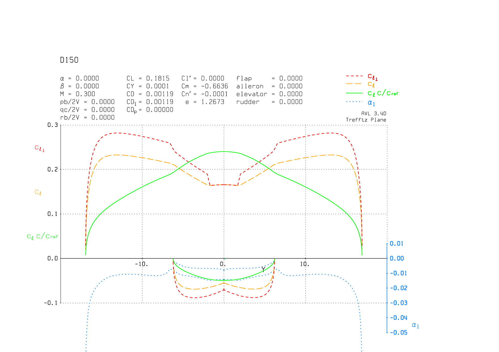

# PyAVL

**Categories:** Aerodynamics, vortex lattice method, low-fidelity.

**State**: :heavy_check_mark:

`PyAVL` module is a launcher for the [Athena Vortex Lattice (AVL)](https://web.mit.edu/drela/Public/web/avl/) solver, developed by M. Drela and H. Youngren at MIT. It is a vortex lattice method (VLM) solver for low-fidelity aerodynamic computations.

## Inputs

`PyAVL` takes as input a CPACS file, the aircraft geometry is read to create the VLM model for the wings and fuselage. The flight conditions have to be defined within an aeromap, as well as the number of vortex panels to use.

Example of AVL geometry model.

## Analyses

`PyAVL` computes the aerodynamic coefficients of an aircraft for a given aeromap and writes the results in a CPACS file. It calculates the total forces on the aircraft, the forces on individual surfaces, the forces on wing strips, and the forces on each panel. The stability derivatives can also be computed.

## Outputs

`PyAVL` outputs a CPACS file with the aerodynamic coefficients added in the aeromap. The settings of the simulation (number of chordwise/spanwise vortices, vortex distribution) are saved. The following force files are saved:
- `ft.txt`: Total Forces.
- `fn.txt`: Surface Forces.
- `fs.txt`: Strip Forces.
- `fe.txt`: Element Forces (vortex strength).

The following plots are generated:
- `plot.pdf`: it contains a plot of the initial AVL geometry model, and a plot with the aerodynamic loads on the aircraft.
- `lift_distribution.png`: plot of the lift distribution along the span.

Example of aerodynamic loads computed by AVL.

## Installation or requirements

Following the automatic installation procedure on the [CEASIOMpy installation page](../../installation/INSTALLATION.md) should install `PyAVL` automatically along with the other tools.

## Limitations

`PyAVL` uses a Vortex Lattice Method solver:
- The flow is quasi-steady and ideal: incompressible, irrotational, and inviscid.
- The flow is low-subsonic: [Prandlt-Glauert transformation](https://en.wikipedia.org/wiki/Prandtl%E2%80%93Glauert_transformation) is used to adapt the equations up to Mach 0.6.
- Lifting surfaces are assumed to be thin, the thickness is not taken into account.
- The angle of attack and sideslip must be small.
- Viscous effects, turbulence or boundary layer phenomena are not solved at all.

## More information

- [AVL documentation.](https://web.mit.edu/drela/Public/web/avl/AVL_User_Primer.pdf)
- [AVL website.](https://web.mit.edu/drela/Public/web/avl/)
- [Flight Vehicule Aerodynamics](https://mitpress.mit.edu/9780262526449/flight-vehicle-aerodynamics/) by M. Drela.
- [Low-Speed Aerodynamics](https://www.cambridge.org/core/books/lowspeed-aerodynamics/077FAF851C4582F1B7593809752C44AE) by J. Katz and A. Plotkin.
- [Aerodynamics for Engineers](https://www.cambridge.org/highereducation/books/aerodynamics-for-engineers/C8AAC9F38F0781CA38AB65FA85E61CCF#overview) by J. Bertin.

## Settings reference (WIP)

### Where settings live in CPACS

- Base XPath: `CEASIOMpy/avl` (see `src/ceasiompy/PyAVL/__init__.py`)
- Streamlit GUI definitions: `src/ceasiompy/PyAVL/__specs__.py`

### Runtime mapping (CPACS → AVL)

- Geometry conversion: `src/ceasiompy/PyAVL/func/cpacs2avl.py` writes the `.avl` input geometry file.
- Case/run generation: `src/ceasiompy/PyAVL/func/config.py` writes the AVL command file
  (`avl_commands.txt`) per case and launches AVL.
- Results parsing: `src/ceasiompy/PyAVL/func/results.py` reads force outputs and writes coefficients
  back into CPACS aeromaps.

### Panel settings

#### Panel distribution

- **GUI label:** “Panel distribution”
- **CPACS XPath:** `.../VortexDistribution/Distribution` (`AVL_DISTR_XPATH`)
- **Used in geometry file as:** AVL’s `Sspace` / `Cspace` distribution flag (internally converted to
  `1=cosine`, `2=sine`, `3=equal`). See `src/ceasiompy/PyAVL/func/utils.py:convert_dist_to_avl_format`
  and `src/ceasiompy/PyAVL/func/cpacs2avl.py`.

#### Chordwise vortices

- **GUI label:** “Chordwise vortices”
- **CPACS XPath:** `.../VortexDistribution/Nchordwise` (`AVL_NCHORDWISE_XPATH`)
- **Used in geometry file as:** `Nchordwise` panel count for each surface section (see
  `src/ceasiompy/PyAVL/func/cpacs2avl.py`).

#### Spanwise vortices

- **GUI label:** “Spanwise vortices”
- **CPACS XPath:** `.../VortexDistribution/Nspanwise` (`AVL_NSPANWISE_XPATH`)
- **Used in geometry file as:** `Nspanwise` panel count for each surface section (see
  `src/ceasiompy/PyAVL/func/cpacs2avl.py`).

### Specific settings

#### Rotation rates

- **GUI label:** “Rotation rates”
- **CPACS XPath:** `.../RotationRates` (`AVL_ROTRATES_XPATH`)
- **Format:** a `;`-separated list of floats interpreted as a single rate value (in **deg/s**) that
  is expanded into AVL’s `p`, `q`, `r` via “zero-independent” combinations when needed for SDSA-like
  datasets. See `src/ceasiompy/PyAVL/func/utils.py:duplicate_elements`.
- **Used in AVL command file as:** non-dimensionalized rates:
  - `r` (roll), `p` (pitch), `y` (yaw) commands in `avl_commands.txt` after scaling by `b/(2V)` or
    `c/(2V)` (see `src/ceasiompy/utils/mathsfunctions.py:non_dimensionalize_rate` and
    `src/ceasiompy/PyAVL/func/config.py:write_command_file`).

Practical limit checks:
- CEASIOMpy checks the AVL “practical limits” (e.g. `pb/2V` range) and raises if out of range (see
  `src/ceasiompy/PyAVL/func/utils.py:practical_limit_rate_check`).

#### Control surface angles

- **GUI label:** “Control surface angles”
- **CPACS XPath:** `.../ControlSurfaceAngles` (`AVL_CTRLSURF_ANGLES_XPATH`)
- **Format:** a `;`-separated list of floats (in **deg**) used as deflections in the AVL run.
- **Used in AVL command file as:** `d2`, `d3`, `d4` control deflections, corresponding to:
  - `d2`: aileron
  - `d3`: elevator
  - `d4`: rudder
  (see `src/ceasiompy/PyAVL/func/config.py:write_command_file`).

#### Default freestream Mach

- **GUI label:** “Default freestream Mach”
- **CPACS XPath:** `.../FreestreamMach` (`AVL_FREESTREAM_MACH_XPATH`)
- **Used in geometry file as:** the `.avl` header Mach number (see `src/ceasiompy/PyAVL/func/cpacs2avl.py`).

### Geometry inclusion

#### Integrate fuselage

- **GUI label:** “Integrate fuselage”
- **CPACS XPath:** `.../IntegrateFuselage` (`AVL_FUSELAGE_XPATH`)
- **Effect:** when enabled, CEASIOMpy adds a fuselage body to the AVL model during CPACS→AVL
  conversion (see `src/ceasiompy/PyAVL/func/cpacs2avl.py`).
