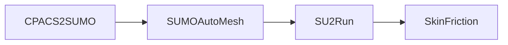

# SU2Run

**Categories:** Aerodynamics, CFD, aeromaps, Actuator disk

**State**: :heavy_check_mark:

`SU2Run` module can prepare and run calculations with the CFD code [SU2](https://su2code.github.io/). SU2 is a computational analysis and design package that has been developed to solve multiphysics analysis and optimization tasks using unstructured mesh topologies. [[1]](#Economon15)

## Inputs

`SU2Run` takes as input a CPACS file, the mesh must have been generated by another module. Typical workflow which includes `SU2Run` looks like:

The flight conditions must be defined by an aeromap from the CPACS file. Some calculation parameters can also be defined in the CPACS file (but some value will by provided by default).

If a propeller is define in the CPACS file it could be converted as an actuator disk to be included in the CFD calculation automatically. Some parameters will be available in the GUI interface.

## Analyses

`SU2Run` calculates aerodynamic coefficients of an aircraft for a given mesh and aeromap. It performs an Euler calculation with the SU2 code.

If a propeller is define and added as an actuator disk in the mesh, the thrust distribution will be calculated ??? theory [[2]](#Seatta). An "ActuatorDisk.dat" file will be create and later read by SU2.

Other results can be obtained from the SU2 calculation, generally [Paraview](https://www.paraview.org/) is used to visualize the results.

## Outputs

`SU2Run` outputs a CPACS file with the calculated aerodynamic coefficients added into the aeromap. In the results directory, a directory named `SU2` is created during the calculation, in it you all the results files produce by SU2. Depending the parameter selected the results produce may differ.

## Installation or requirements

`SU2Run` is a native CEASIOMpy module, hence it is available and installed by default. To run it, you just have to be sure that you are in the CEASIOMpy Conda environment.

However to run `SU2Run` module, SU2 must be installed on your computer. Please refer to the [CEASIOMpy installation page](../../installation/INSTALLATION.md) to see if an automatic installation script is available for your OS.
For more information check out the official [SU2 installation page](https://su2code.github.io/docs_v7/Installation/).

We recommend to use a recent version of SU2, with older versions you might encounter some issues with the configuration file in which options are regularly changed.

## Limitations

Although SU2 is able to run Navier-Stokes calculations, for now, `SU2Run` only supports Euler calculation, that is to say the skin friction is neglected. You can use the [`SkinFriction`](../SkinFriction/README.md) module to calculate the skin frictions (with empirical methods) afterwards and add them to the drag coefficient.

If you want to perform calculation on an aircraft with an actuator disk you must use the module `CPACS2GMSH` to create the mesh. `CPACS2SUMO` and `SUMOAutoMesh` modules will NOT be able to add an actuator disk.

:warning: When you run `SU2Run` module, the number of iterations is set manually, be careful to check if it is enough to reach the convergence of the aerodynamic coefficients and ideally a good reduction of the residual.

:warning: The mesh convergence should also be checked. If you use a mesh too coarse, the aerodynamic coefficients might be far from the values you would expect with a finer mesh.

For unsteady simulations, it uses by default time marching : DUAL_TIME_STEPPING-2ND_ORDER.

## More information

* [SU2 website](https://su2code.github.io/)

* [SU2 Github repository](https://github.com/su2code/SU2)

* <https://en.wikipedia.org/wiki/Euler_equations_(fluid_dynamics>)

* [SU2 Actuator disk](https://su2code.github.io/tutorials/ActuatorDisk_VariableLoad/)

## References

<a id="Economon15">[1]</a> Economon and al. : SU2: An open-source suite for multiphysics simulation and design, AIAA Journal, 54(3):828-846, 2016. <http://arc.aiaa.org/doi/10.2514/1.J053813>

<a id="Saetta20">[2]</a> Saetta20 and al. : Implementation and validation of a new actuator disk model in SU2, SU2 Conference 2020, 10/06/2020. <https://su2foundation.org/wp-content/uploads/2021/10/SU2_paper_UniNa_withHeader-1.pdf>
