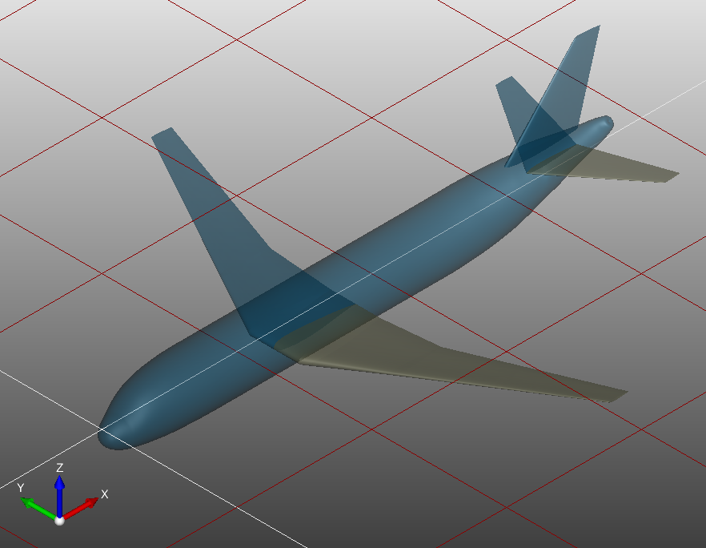

# CEASIOMpy - Test case 1

For the first test case, we will run a simple workflow which is already set up, you will just run it and observe the results. For this workflow, we will use the D150 aircraft (D150_simple.xml) which is a A320-like aircraft.

<p align="center">

</p>
<p align="center">
3D view of the D150 aircraft
</p>

To run this test case, you will need to open a terminal and run the following command (:warning: Working directory for this test case will be written where you are running the command):

```bash
# To be in the CEASIOMpy Conda environment with all the dependencies
conda activate ceasiompy

# To run the test case 1
ceasiompy_run --testcase 1
```

This workflow will take as input the CPACS file of the aircraft (D150_simple.xml), it will run the PyTornado module, and it will export the aerodynamic coefficients in a CSV file.


You can find the exported CSV file in the results dir: `/Workflow_001/Results/Aeromaps/test_apm.csv` and it should look like this:

```text
altitude,machNumber,angleOfSideslip,angleOfAttack,cd,cl,cs,cmd,cml,cms
0,0.3,0,0,-0.00039292,0.174408,-4.22056e-05,1.58687e-05,-0.000366356,-0.644432
0,0.3,0,10,0.0436328,1.11033,-5.01942e-05,4.44515e-05,-0.000424174,-4.71641
0,0.3,10,0,0.0890734,0.116367,-0.0617965,0.201313,-0.570729,-0.410061
0,0.3,10,10,0.0545719,1.08554,-0.100854,0.249796,-0.84655,-4.65115
```

You can see than PyTornado ran four calculations with different angles of attack and sideslip, but the same altitude and Mach number. On the next test case, you will learn how to define your own flight parameters.

These results have also been written in the last output CPACS file that you can find at : `/Workflow_001/02_ExportCSV/ToolOutput.xml`. It is a big file, because it contains all the geometric description of the aircraft. However, if you open it in a text editor and look for `test_apm`, you should find the following:

```xml
<aeroMap uID="test_apm">
  <name>test_apm</name>
  <description>Aeromap for tests</description>
  <boundaryConditions>
    <atmosphericModel>ISA</atmosphericModel>
  </boundaryConditions>
  <aeroPerformanceMap>
    <altitude mapType="vector">0;0;0;0</altitude>
    <machNumber mapType="vector">0.3;0.3;0.3;0.3</machNumber>
    <angleOfAttack mapType="vector">0;10;0;10</angleOfAttack>
    <angleOfSideslip mapType="vector">0;0;10;10</angleOfSideslip>
    <cl mapType="vector">0.174408;1.11033;0.116367;1.08554</cl>
    <cd mapType="vector">-0.00039292;0.0436328;0.0890734;0.0545719</cd>
    <cs mapType="vector">-4.22056e-05;-5.01942e-05;-0.0617965;-0.100854</cs>
    <cml mapType="vector">-0.000366356;-0.000424174;-0.570729;-0.84655</cml>
    <cms mapType="vector">-0.644432;-4.71641;-0.410061;-4.65115</cms>
    <cmd mapType="vector">1.58687e-05;4.44515e-05;0.201313;0.249796</cmd>
</aeroPerformanceMap>
```

You can see that parameters `altitude`, `machNumber`, `angleOfSideslip`, `angleOfAttack` and coefficients `cl`, `cd`, `cs`, `cml`, `cms` and `cmd` are defined as lists of four values, representing the four calculations made by PyTornado.

| [Home](../../README.md#test-cases) | Next test case [**>>**](../test_case_2/README.md)
