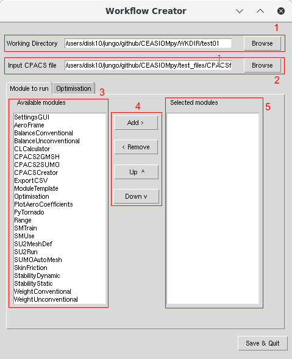
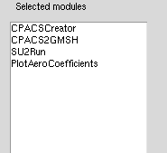

# CEASIOMpy - Test case 2

## Create and run a workflow with the GUI

In this second test case, we will learn how to create a CEASIOMpy workflow with the help of the Graphical User Interface (GUI).
To run this test case, you will need to open a terminal and run the following command (:warning: Working directory for this test case will be written where you are running the command):

```bash
# To be in the CEASIOMpy Conda environment with all the dependencies
conda activate ceasiompy

# To run the test case 2
ceasiompy_run --testcase 2
```

By running the above command, you will see the following window:

<p align="center">

</p>
<p align="center">
CEASIOMpy Workflow Creator GUI
</p>

The different important parts of this window are:

1. Selection of the Working Directory (where your project will be saved)
1. Selection of the input CPACS file
1. List of all the available modules that could be used to create the workflow
1. Button to add/remove/move modules in your workflow
1. List of all the modules in your workflow (the order is important)

With this GUI, we will try to build the following workflow:


To do so, we will have to:

* Change the working directory, if needed.
* Keep the CPACS file as is.
* Add one by one, the modules to the workflow.

Your Selected modules list should now look like this:

<p align="center">

</p>
<p align="center">
</p>

We can now click on "Save & Quit" on the bottom of the window. The window will close and the `CPACSCreator` window will open.

<p align="center">

</p>
<p align="center">
CPACSCreator Interface
</p>

With CPACSCreator, we can modify the geometry of the aircraft. We will not do that in this tutorial, but you can check the following links for more information:

* [CPACSCreator tutorial](https://dlr-sc.github.io/tigl/doc/cpacscreator-0.1/tuto.html#tuto_create_from_scratch)

* [CPACSCreator video tutorial](https://www.youtube.com/watch?v=M5ryc7HT3uA)

In our case we can just save the file and close the window. The next step will run automatically. It will convert the geometry and create a mesh with `GMSH` and then run the `SU2` software. It could take a while depending on your computer. We should be able to see what is happening in the the terminal window or by reading the log file: */CEASIOMpy/ceasiompy.txt*

When the calculation is over, a new window will open with some graphs of the aerodynamic coefficients. On these graphs we can see there is only one point, it correspond to the calculation we ran. In the next test case we will see how to perform calculation on a larger aerodynamic database and plot the polar of the aircraft.

<p align="center">

</p>
<p align="center">
PlotAeroCoefficients results
</p>

[**<<**](../test_case_1/README.md) Previous test case | [Home](../../README.md#test-cases) | Next test case [**>>**](../test_case_3/README.md)
